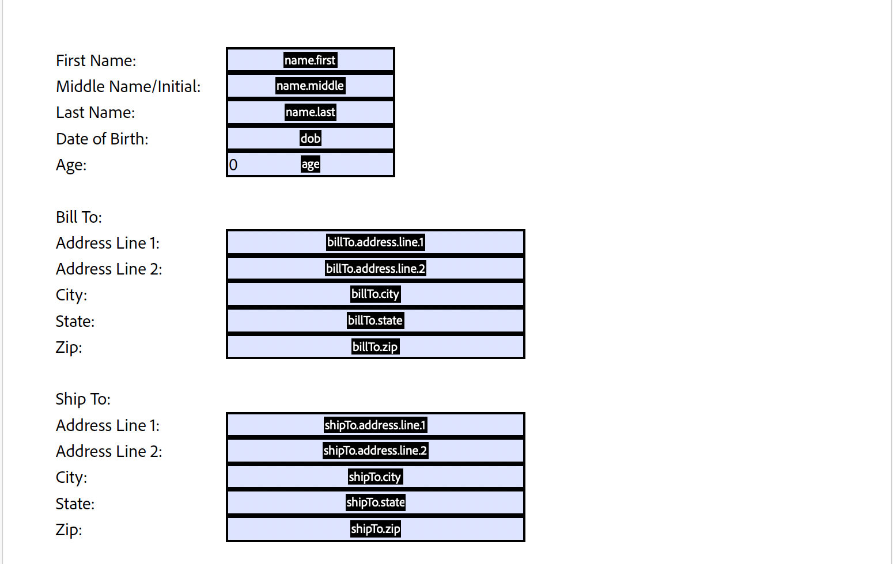

# Export PDF Form Data

The Export PDF Form Data API will retrieve the data from a PDF form and return it as a JSON file


## Input Documents : **Required**

Supported formats:

- **PDF (application/pdf)** – Only **PDF version 1.6 and above** is supported.
- **AcroForm and Static XFA** – The input document must contain an **interactive form** from which data needs to be extracted.

### Input Document

A **filled interactive PDF form (AcroForm/Static XFA)** from which data needs to be exported.

#### Important Notes:

- **Only Static XFA files are supported.**
- **Dynamic XFA format is not supported** and will result in an error.

## REST API

See our public API Reference for [Export PDF Form Data API](../../../apis/#tag/Export-PDF-Form-Data).

## Export PDF Form Data

The sample below exports PDF form data and returns it as a JSON file.

Please refer to the [API usage guide](../api-usage.md) to understand how to use our APIs.

<CodeBlock slots="heading, code" repeat="2" languages="Java, REST API" />

#### Java

```javascript
// Get the samples from https://www.adobe.com/go/pdftoolsapi_java_samples
// Run the sample:
// mvn -f pom.xml exec:java -Dexec.mainClass=com.adobe.pdfservices.operation.samples.ExportPDFFormData

public class ExportPDFFormData {
    // Initialize the logger
    private static final Logger LOGGER = LoggerFactory.getLogger(ExportPDFFormData.class);

    public static void main(String[] args) {
        try (InputStream inputStream = Files.newInputStream(new File("src/main/resources/exportPdfFormDataInput.pdf").toPath())) {
            // Initial setup, create credentials instance
            Credentials credentials = new ServicePrincipalCredentials(System.getenv("PDF_SERVICES_CLIENT_ID"), System.getenv("PDF_SERVICES_CLIENT_SECRET"));
        
            // Creates a PDF Services instance
            PDFServices pdfServices = new PDFServices(credentials);
        
            // Creates an asset(s) from source file(s) and upload
            Asset asset = pdfServices.upload(inputStream, PDFServicesMediaType.PDF.getMediaType());
        
            // Creates a new job instance
            ExportPDFFormDataJob exportPDFFormDataJob = new ExportPDFFormDataJob(asset);
        
            // Submit the job and gets the job result
            String location = pdfServices.submit(exportPDFFormDataJob);
            PDFServicesResponse<ExportPDFFormDataResult> pdfServicesResponse = pdfServices.getJobResult(location, ExportPDFFormDataResult.class);
        
            // Get content from the resulting asset(s)
            Asset resultAsset = pdfServicesResponse.getResult().getAsset();
            StreamAsset streamAsset = pdfServices.getContent(resultAsset);

            Files.createDirectories(Paths.get("output/"));
            OutputStream outputStream = Files.newOutputStream(new File("output/ExportPDFFormData.pdf").toPath());
            LOGGER.info(String.format("Saving asset at output/ExportPDFFormData.pdf", outputFilePath));
            IOUtils.copy(streamAsset.getInputStream(), outputStream);
            outputStream.close();
        } catch (ServiceApiException | IOException | SDKException | ServiceUsageException ex) {
            LOGGER.error("Exception encountered while executing operation", ex);
        }
    }
}
```

#### REST API

```javascript
// Please refer our REST API docs for more information 
// https://developer.adobe.com/document-services/docs/apis/#tag/Export-PDF-Form-Data

curl --location --request POST 'https://pdf-services.adobe.io/operation/getformdata' \
--header 'x-api-key: {{Placeholder for client_id}}' \
--header 'Content-Type: application/json' \
--header 'Authorization: Bearer {{Placeholder for token}}' \
--data-raw '{
    "assetID": "urn:aaid:AS:UE1:23c30ee0-2e4d-46d6-87f2-087832fca718"
}'
```
