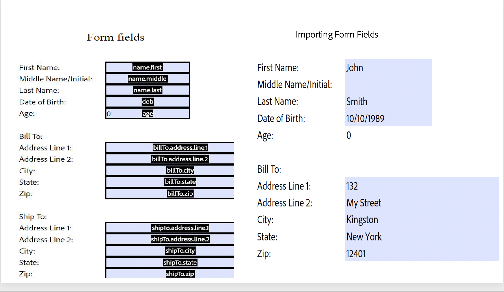

# Import PDF Form
The Import PDF Form Data API will take the form data provided as a JSON, insert it into the PDF form, and generate the resulting PDF document.


## Input Documents : **Required**

Supported format is PDF (application/pdf). Input PDF with version 1.6 and above is supported.

### Input Document

A PDF document basically an acroform to which the data needs to be imported from a json file that contains the form data.

## REST API

See our public API Reference for [Import PDF Form API](../../../apis/#tag/Import-PDF-Form-Data).

## Import PDF Form Data

The sample below exports a PDF form data and returns it as a JSON file.

Please refer to the [API usage guide](../api-usage.md) to understand how to use our APIs.

<CodeBlock slots="heading, code" languages="REST API" />

#### REST API

```javascript
// Please refer our REST API docs for more information 
// https://developer.adobe.com/document-services/docs/apis/#tag/Export-PDF-Form-API

curl --location --request POST 'https://pdf-services.adobe.io/operation/setformdata' \
--header 'x-api-key: {{Placeholder for client_id}}' \
--header 'Content-Type: application/json' \
--header 'Authorization: Bearer {{Placeholder for token}}' \
--data-raw '{
    "assetID": "urn:aaid:AS:UE1:23c30ee0-2e4d-46d6-87f2-087832fca718",
    "jsonFormFieldsData":"{}"
}'
```
