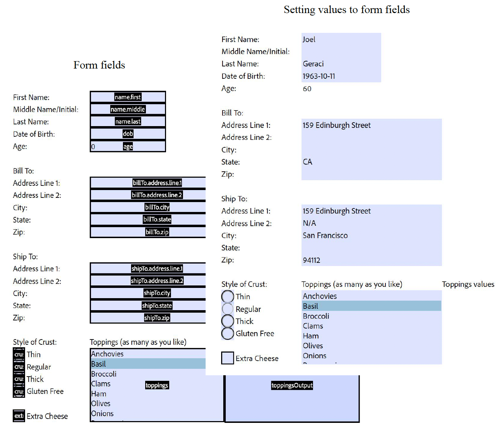

# Export PDF Form
The Import PDF Form Data API will take the form data provided as a JSON, insert it into the PDF form, and generate the resulting PDF document.


## Input Documents : **Required**

Supported format is PDF (application/pdf). Input PDF with version 1.6 and above is supported.

### Input Document

A PDF document basically an acroform to which the data needs to be imported from a json file that contains the form data.

## REST API

See our public API Reference for [Import PDF Form API](../../../apis/#tag/Import-PDF-Form-Data).

## Import PDF Form Data

The sample below exports a PDF form data and returns it as a JSON file.

Please refer to the [API usage guide](../api-usage.md) to understand how to use our APIs.

<CodeBlock slots="heading, code" repeat="5" languages="Java, .NET, Node JS, Python, REST API" />

#### Java

```javascript 
// Get the samples from https://www.adobe.com/go/pdftoolsapi_java_samples
// Run the sample:
// mvn -f pom.xml exec:java -Dexec.mainClass=com.adobe.pdfservices.operation.samples.importformpdf.Importform

public class ImportPdfForm {

   // Initialize the logger.
   private static final Logger LOGGER = LoggerFactory.getLogger(ImportPdfForm.class);

   public static void main(String[] args) {

     try (InputStream inputStream = Files.newInputStream(new File("src/main/resources/importPDFForm.pdf").toPath())) {
        // Initial setup, create credentials instance
        Credentials credentials = new ServicePrincipalCredentials(
                System.getenv("PDF_SERVICES_CLIENT_ID"),
                System.getenv("PDF_SERVICES_CLIENT_SECRET"));

        // Creates a PDF Services instance
        PDFServices pdfServices = new PDFServices(credentials);

        // Creates an asset(s) from source file(s) and upload
        Asset asset = pdfServices.upload(inputStream, PDFServicesMediaType.PDF.getMediaType());
        
        // Create parameters for the job
        ImportPDFFormParams importPDFFormParams = GetImportPDFFormParams();

        // Creates a new job instance
        ImportPDFFormJob importPDFFormJob = new ImportPDFFormJob(asset,importPDFFormParams);

        // Submit the job and gets the job result
        String location = pdfServices.submit(importPDFFormJob);
        PDFServicesResponse<ImportPDFFormResult> pdfServicesResponse = pdfServices.getJobResult(location, ImportPDFFormResult.class);

        // Get content from the resulting asset(s)
        Asset resultAsset = pdfServicesResponse.getResult().getAsset();
        StreamAsset streamAsset = pdfServices.getContent(resultAsset);

        // Creates an output stream and copy stream asset's content to it
        Files.createDirectories(Paths.get("output/"));
        OutputStream outputStream = Files.newOutputStream(new File("output/importform.pdf").toPath());
        LOGGER.info("Saving asset at output/exportPdfOutput.docx");
        IOUtils.copy(streamAsset.getInputStream(), outputStream);
     } catch (ServiceApiException | IOException | SDKException | ServiceUsageException ex) {
       LOGGER.error("Exception encountered while executing operation", ex);
     }
   }
 }
  
```

#### .NET

```javascript
// Get the samples from https://www.adobe.com/go/pdftoolsapi_net_samples
// Run the sample:
// cd ImportPDFForm/
// dotnet run importformpdf.csproj

namespace ImportPDFForm
{
    class Program
    {
        private static readonly ILog log = LogManager.GetLogger(typeof(Program));

        static void Main()
        {
            //Configure the logging
            ConfigureLogging();
            try
            {
                // Initial setup, create credentials instance
                ICredentials credentials = new ServicePrincipalCredentials(
                    Environment.GetEnvironmentVariable("PDF_SERVICES_CLIENT_ID"),
                    Environment.GetEnvironmentVariable("PDF_SERVICES_CLIENT_SECRET"));

                // Creates a PDF Services instance
                PDFServices pdfServices = new PDFServices(credentials);

                // Creates an asset from source file and upload
                using Stream inputStream = File.OpenRead(@"exportPdfForm.pdf");
                IAsset asset = pdfServices.Upload(inputStream, PDFServicesMediaType.PDF.GetMIMETypeValue());
                

                // Creates a new job instance
                ImportPDFFormJob importPDFformJob = new ImportPDFFormJob(asset, importPDFParams);

                // Submits the job and gets the job result
                String location = pdfServices.Submit(importPDFformJob);
                PDFServicesResponse<ImportPDFFormResult> pdfServicesResponse =
                    pdfServices.GetJobResult<ImportPDFFormResult>(location, typeof(ImportPDFFormResult));

                // Get content from the resulting asset(s)
                IAsset resultAsset = pdfServicesResponse.Result.Asset;
                StreamAsset streamAsset = pdfServices.GetContent(resultAsset);

                // Creating output streams and copying stream asset's content to it
                Stream outputStream = File.OpenWrite(Directory.GetCurrentDirectory() + "/output/importPdfForm.pdf");
                streamAsset.Stream.CopyTo(outputStream);
                outputStream.Close();
            }
            catch (ServiceUsageException ex)
            {
                log.Error("Exception encountered while executing operation", ex);
            }
            catch (ServiceApiException ex)
            {
                log.Error("Exception encountered while executing operation", ex);
            }
            catch (SDKException ex)
            {
                log.Error("Exception encountered while executing operation", ex);
            }
            catch (IOException ex)
            {
                log.Error("Exception encountered while executing operation", ex);
            }
            catch (Exception ex)
            {
                log.Error("Exception encountered while executing operation", ex);
            }
        }

        static void ConfigureLogging()
        {
            ILoggerRepository logRepository = LogManager.GetRepository(Assembly.GetEntryAssembly());
            XmlConfigurator.Configure(logRepository, new FileInfo("log4net.config"));
        }
    }
}
```

#### Node JS

```javascript
// Get the samples from http://www.adobe.com/go/pdftoolsapi_node_sample
// Run the sample:
// node src/importpdfform/import-pdf-form.js

const {
    ServicePrincipalCredentials,
    PDFServices,
    MimeType,
    ExportPDFFormJob,
    ExportPDFTargetFormat,
    ExportPDFFormResult,
    SDKError,
    ServiceUsageError,
    ServiceApiError
} = require("@adobe/pdfservices-node-sdk");
const fs = require("fs");

(async () => {
    let readStream;
    try {
        // Initial setup, create credentials instance
        const credentials = new ServicePrincipalCredentials({
            clientId: process.env.PDF_SERVICES_CLIENT_ID,
            clientSecret: process.env.PDF_SERVICES_CLIENT_SECRET
        });

        // Creates a PDF Services instance
        const pdfServices = new PDFServices({credentials});

        // Creates an asset(s) from source file(s) and upload
        readStream = fs.createReadStream("./importPDFForm.pdf");
        const inputAsset = await pdfServices.upload({
            readStream,
            mimeType: MimeType.PDF
        });
        

        // Creates a new job instance
        const job = new ImportPDFFormJob({inputAsset});

        // Submit the job and get the job result
        const pollingURL = await pdfServices.submit({job});
        const pdfServicesResponse = await pdfServices.getJobResult({
            pollingURL,
            resultType: ImportPDFFormResult
        });

        // Get content from the resulting asset(s)
        const resultAsset = pdfServicesResponse.result.asset;
        const streamAsset = await pdfServices.getContent({asset: resultAsset});

        // Creates an output stream and copy stream asset's content to it
        const outputFilePath = "./importPDFForm.pdf";
        console.log(`Saving asset at ${outputFilePath}`);

        const outputStream = fs.createWriteStream(outputFilePath);
        streamAsset.readStream.pipe(outputStream);
    } catch (err) {
        if (err instanceof SDKError || err instanceof ServiceUsageError || err instanceof ServiceApiError) {
            console.log("Exception encountered while executing operation", err);
        } else {
            console.log("Exception encountered while executing operation", err);
        }
    } finally {
        readStream?.destroy();
    }
})();
```

#### Python

```python
# Get the samples https://github.com/adobe/pdfservices-python-sdk-samples
# Run the sample:
# python src/importpdfform/import_pdf_form.py

# Initialize the logger
logging.basicConfig(level=logging.INFO)

class ImportPDFForm:
    def __init__(self):
        try:
            file = open('./importPDFForm.pdf', 'rb')
            input_stream = file.read()
            file.close()

            # Initial setup, create credentials instance
            credentials = ServicePrincipalCredentials(
                client_id=os.getenv('PDF_SERVICES_CLIENT_ID'),
                client_secret=os.getenv('PDF_SERVICES_CLIENT_SECRET')
            )

            # Creates a PDF Services instance
            pdf_services = PDFServices(credentials=credentials)

            # Creates an asset(s) from source file(s) and upload
            input_asset = pdf_services.upload(input_stream=input_stream, mime_type=PDFServicesMediaType.PDF)

            # Creates a new job instance
            import_pdf_form_job = ImportPDFFormJob(input_asset=input_asset)

            # Submit the job and gets the job result
            location = pdf_services.submit(import_pdf_form_job)
            pdf_services_response = pdf_services.get_job_result(location, ImportPDFFormResult)

            # Get content from the resulting asset(s)
            result_asset: CloudAsset = pdf_services_response.get_result().get_asset()
            stream_asset: StreamAsset = pdf_services.get_content(result_asset)

            # Creates an output stream and copy stream asset's content to it
            output_file_path = 'output/ImportPDFForm.pdf'
            with open(output_file_path, "wb") as file:
                file.write(stream_asset.get_input_stream())

        except (ServiceApiException, ServiceUsageException, SdkException) as e:
            logging.exception(f'Exception encountered while executing operation: {e}')

if __name__ == "__main__":
    ImportPDFForm()
```

#### REST API

```javascript
// Please refer our REST API docs for more information 
// https://developer.adobe.com/document-services/docs/apis/#tag/Export-PDF-Form-API

curl --location --request POST 'https://pdf-services.adobe.io/operation/setformdata' \
--header 'x-api-key: {{Placeholder for client_id}}' \
--header 'Content-Type: application/json' \
--header 'Authorization: Bearer {{Placeholder for token}}' \
--data-raw '{
    "assetID": "urn:aaid:AS:UE1:23c30ee0-2e4d-46d6-87f2-087832fca718",
    "jsonFormFieldsData":"{}"
}'
```