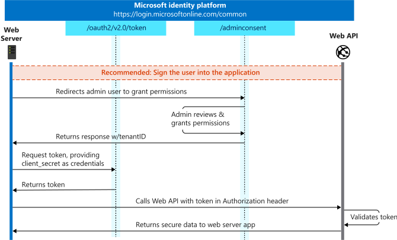

# Overview

## **What is External Storage Solution?**

Adobe PDF Services API also provides capabilities of accessing files from the external storage of the client directly. This helps to reduce the friction for the client by removing the overhead of uploading and downloading the document from our transient storage. For accessing files present on the client's storage, we are making use of Signed URLs of the file.

**Signed URIs:** A signed URL is a URL that provides limited permission and time to make a request. Signed URLs contain authentication information in their query string, allowing users without credentials to perform specific actions on a resource. We can generate a download and upload the pre-signed URL of a file and share it with the required entity.

PDF Services API supports the passing of signed URLs of input and output files in the request body. Please refer here for API specs with signed URLs.

## Supported External Storage Solutions

The concept of Signed URLs is common across various cloud storage solutions for downloading and uploading files. Adobe PDF Services for now, only supports the signed URLs generated from
- Sharepoint
- Amazon S3

Any other Storage solution's Signed URLs will not work with PDF Services and will fail the API operation.

## Sharepoint Storage
For clients having SharePoint storage for their documents, PDF Services API will connect directly with Sharepoint to download and upload the files using SharePoint Signed URLs. Signed URLs for Sharepoint files can be done using Sharepoint REST API V1 or Sharepoint REST API V2 or Microsoft Graph. Microsoft Graph can be used to connect to SharePoint using SharePoint API in Microsoft Graph.

Let's understand the Sharepoint Storage Hierarchy


The SharePoint sites are essentially containers for information. The way you store and organize things in SharePoint is by Sites. 

There are mini-applications present in each site known as Sharepoint web parts. Document Library, Tasks, Calendar, etc. are examples of Sharepoint web parts.

A SharePoint document library is a container for creating, organizing, and managing different types of documents. You can also share the files or documents with other users of your site.

**Generating Signed URLs in Sharepoint**

***Setting App Permissions***
- Clients who want to use SharePoint storage with Adobe PDF Services APIs need to create an Azure Active Directory Application in their organization's Azure Active Directory Portal. That application will work as [Server Side App](https://learn.microsoft.com/en-us/azure/active-directory/develop/v2-app-types#daemons-and-server-side-apps), without any logged-in user, to access files and folders present in their organization SharePoint Site's Document Library. Refer [here](https://learn.microsoft.com/en-us/azure/active-directory/develop/howto-create-service-principal-portal) for registering an App in AAD (Azure Active Directory).

- Once the App is registered, Service Principal for the app is automatically created.

- Authentication for the Service principal should happen with certificate-based auth flow (Auth 2.0 Client Credential Flow). Refer [here](https://learn.microsoft.com/en-us/azure/active-directory/develop/howto-create-service-principal-portal#set-up-authentication) for Authentication Setup using Certificates.

- Once the authentication is set up, the next step is to Grant App Permission for Web API. 
  - Select **App registrations** from the Azure AD portal, and then select the app that you created (**App 1**).
  - Under **Manage**, select **API permissions**. 
  - Under Configured permissions, select **Add a permission**. 
  - Under the Microsoft APIs tab, select **Microsoft Graph**. 
  - Click **Application permissions**. 
  - Under **Permission**, Add/Checkmark the following scopes; 
    - Files.ReadWrite.All 
    - Sites.ReadWrite.All (This is a site-wide read-write access, for limited access you can use - Sites.Selected Scope by following this [link](https://devblogs.microsoft.com/microsoft365dev/updates-on-controlling-app-specific-access-on-specific-sharepoint-sites-sites-selected/))
    - Application.ReadWrite.All 
  - Select **Add permissions**.
  - Select **Grant admin consent for &lt;your tenant name&gt;** (Make sure you are tenant admin to grant app-only permissions or request tenant admin to approve your request by [Grant Admin Consent](https://learn.microsoft.com/en-us/azure/active-directory/manage-apps/grant-admin-consent?pivots=portal#grant-admin-consent-in-app-registrations) workflow). 
  - Select **Yes**. 
  - Select **Refresh**, and then verify that **Granted for ...** appears under **Status** for all the scopes.

***Generating Access Token***

- Now we will obtain an Access Token using the client credentials flow.
- 
  - First, we have to obtain the admin consent for approving the app's permission to access resources. It's a one-time activity for each app. To get admin consent, use this workflow. 
  - Now we need to generate an [Access Token using the Certificates](https://learn.microsoft.com/en-us/azure/active-directory/develop/v2-oauth2-client-creds-grant-flow#second-case-access-token-request-with-a-certificate) we created above. We will use this access token to generate Signed URLs later.

***Generating Signed URLs***

- We will use Microsoft Graph APIs to generate pre-signed URLs for downloading and uploading files.
- ***Signed URL for download***
  - Invoke Microsoft Graph [content](https://learn.microsoft.com/en-us/graph/api/driveitem-get-content?view=graph-rest-1.0&tabs=http) API to generate a pre-signed download URL for downloading content.
  - Invoke GET _/sites/{siteId}/drive/items/{item-id}/content_ API with access token generated above.
  - API returns a **302 Found** response redirecting to a pre-authenticated download URL for the file. The value present in the "Location" header in the response represents the Signed URL of the file or also known as the Pre-authenticated download URL of the file.
  - 
  - Pre-authenticated download URLs are only valid for a short period (1 hour) and do not require an _Authorization_ header to download.
  
- ***Signed URL for Upload***
  - An Upload Session is created to allow the app to upload files in chunks of varying sizes (it should be a multiple of 320KiB and the Maximum chunk size is 60 MiB) but in proper order. We can also upload entire files in a single go, which is the chosen way inside our APIs for uploading output files. 
  - To upload a file using an upload session, there are two steps:
    - Create an upload session 
    - Upload bytes to the upload session 
  - Creating an upload session:
    - Invoke POST _/sites/{site-id}/drives{{drive-id}}/items/{parent-id}:/{fileRelativePath}/{filename}:/createUploadSession_ with access token generated above along with Headers (Optional)
      ```header
       Content-Type:application/json
       file-name:filename
      ```
    - The response to this request will provide the details of the newly created upload session, which includes the URL to be used for uploading the parts of the file in the response body with keyName - uploadURL.
    - 
    - This upload URL represents the Signed URL for uploading the output file.

    - For more details please refer [here](https://learn.microsoft.com/en-us/graph/api/driveitem-createuploadsession?view=graph-rest-1.0).

## Amazon S3 Storage

Amazon S3 supports pre-signed URLs for downloading and uploading objects to and from S3 buckets without AWS security credentials or permissions.

Refer [here](https://docs.aws.amazon.com/AmazonS3/latest/userguide/using-presigned-url.html) for more details.

## Invoking PDF Services API with Signed URLs


- PDF Services API supports different request schema for supporting external storage solutions using _Input_ and _Output_ request params. For more details click [here](../../../apis/#tag/Document-Generation).


