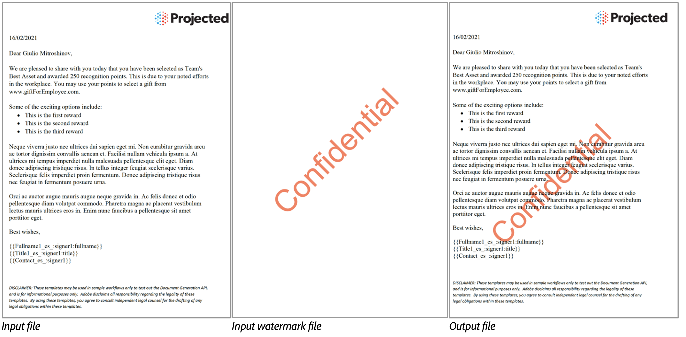

<InlineAlert slots="text"/>

PDF Watermark is currently accessible through the REST API only.

# PDF Watermark

A watermark in a document is usually semi-transparent or faded text, a logo, or a pattern placed in the background or foreground of the page for security, authenticity, and branding.
PDF Watermark API is a cloud based solution to apply watermark on specified pages of PDF document using a source watermark PDF. The first page of source watermark PDF will be added as a watermark in input PDF document. If a page range is not specified, the watermark will be applied on all pages of the source document.



## Input Documents : **Required**

Supported format is PDF (application/pdf). Input PDF with version 1.6 and above is supported.

### Input Document

A PDF document to which a watermark will be applied.

### Watermark Document

A PDF document whose first page will be used as a watermark for the input document.
The output generated will retain the content along with the watermark from the first page.

## Watermark Parameters

### Page ranges (_pageRanges_)

Specifies the number of pages on which the watermark will be applied. Page numbers are indexed from 1 to N. If a page range is not specified, the watermark will be applied on all pages of the source document.
The page ranges are specified as an array of objects whose length cannot exceed beyond 20. Each object has the following properties:
* **Start Page**  (*start*) : The first page number of the range. Default value is 1.
* **End Page**  (*end*) : The last page number of the range. Default value is the last page of the document.

### Appearance (_appearance_)

* **Foreground**  (*appearOnForeground*) : Specifies the placement of the watermark on the page. It can appear in the foreground or background. The default value is true, placing the watermark in the foreground.
* **Opacity**  (*opacity*) : Specifies the opacity of the watermark, represented as an integer percentage value ranging from 0 to 100. The default value is 100.

## REST API

See our public API Reference for [PDF Watermark API](../../../apis/#tag/PDF-Watermark).

## Apply Watermark on specified pages

The sample below performs watermark operation applying watermark in foreground on specified pages of a given PDF.

Please refer the [API usage guide](../gettingstarted.md) to understand how to use our APIs.

<CodeBlock slots="heading, code" repeat="1" languages="REST API" />

#### REST API

```javascript
curl --location --request POST 'https://pdf-services.adobe.io/operation/addwatermark' \
--header 'x-api-key: {{Placeholder for client_id}}' \
--header 'Content-Type: application/json' \
--header 'Authorization: Bearer {{Placeholder for token}}' \
--data-raw '{
    "inputDocumentAssetID": "urn:aaid:AS:UE1:54cbf87f-d7f5-4918-8e4b-9f68",
    "watermarkDocumentAssetID": "urn:aaid:AS:UE1:54cbf87f-d7f5-4918-8e4b-9f1878678e68",
    "pageRanges": [
        {
            "start": 2,
            "end": 5
        },
        {
            "start": 8,
            "end": 10
        }
    ],
    "appearance": {
        "opacity": 50,
        "appearOnForeground": true
    }
}'
```
