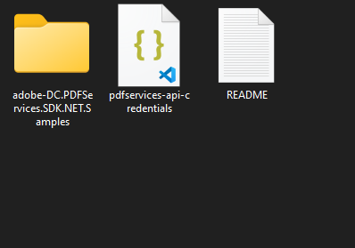

# Quickstart for Adobe PDF Services API (.NET)

To get started using Adobe PDF Services API, let's walk through a simple scenario - taking an input PDF document and exporting it to Microsoft Word. In this guide, we will walk you through the complete process for creating a program that will accomplish this task. 

## Prerequisites

To complete this guide, you will need:

* [.NET: version 8.0 or above](https://dotnet.microsoft.com/en-us/download)
* [.Net SDK](https://dotnet.microsoft.com/en-us/download/dotnet/8.0)
* A build tool: Either Visual Studio or .NET Core CLI.
* An Adobe ID. If you do not have one, the credential setup will walk you through creating one.
* A way to edit code. No specific editor is required for this guide.
  
## Step One: Getting credentials

1) To begin, open your browser to <https://acrobatservices.adobe.com/dc-integration-creation-app-cdn/main.html?api=pdf-services-api>. If you are not already logged in to Adobe.com, you will need to sign in or create a new user. Using a personal email account is recommend and not a federated ID.


2) After registering or logging in, you will then be asked to name your new credentials. Use the name, "New Project". 

3) Change the "Choose language" setting to ".Net". 

4) Also note the checkbox by, "Create personalized code sample." This will include a large set of samples along with your credentials. These can be helpful for learning more later. 

5) Click the checkbox saying you agree to the developer terms and then click "Create credentials."


6) After your credentials are created, they are automatically  downloaded:


## Step Two: Setting up the project

1) In your Downloads folder, find the ZIP file with your credentials: PDFServicesSDK-.NetSamples.zip. If you unzip that archive, you will find a folder of samples and the `pdfservices-api-credentials.json` file.



2) Take the `pdfservices-api-credentials.json` file and place it in a new directory.

3) In your new directory, create a new file, `ExportPDFToWord.csproj`. This file will declare our requirements as well as help define the application we're creating.

```xml
<Project Sdk="Microsoft.NET.Sdk">

  <PropertyGroup>
    <OutputType>Exe</OutputType>
    <TargetFramework>net8.0</TargetFramework>
  </PropertyGroup>

  <ItemGroup>
    <PackageReference Include="Adobe.PDFServicesSDK" Version="4.0.0" />
    <PackageReference Include="log4net" Version="2.0.17" />
  </ItemGroup>

  <ItemGroup>
    <None Update="Bodea Brochure.pdf">
      <CopyToOutputDirectory>Always</CopyToOutputDirectory>
    </None>
    <None Update="log4net.config">
      <CopyToOutputDirectory>Always</CopyToOutputDirectory>
    </None>
  </ItemGroup>

</Project>
```

This file will define what dependencies we need and how the application will be built.

Our application will take a PDF, `Bodea Brochure.pdf` (downloadable from <a href="https://documentcloud.adobe.com/view-sdk-demo/PDFs/Bodea Brochure.pdf">here</a>) and convert it to a Microsoft Word document, `Bodea Brochure.docx`.

4) In your editor, open the directory where you previously copied the credentials and created the `csproj` file. Create a new file, `Program.cs`. 

Now you're ready to begin coding.

## Step Three: Creating the application

1) We'll begin by including our required dependencies:

```javascript
using System;
using System.IO;
using System.Reflection;
using Adobe.PDFServicesSDK;
using Adobe.PDFServicesSDK.auth;
using Adobe.PDFServicesSDK.exception;
using Adobe.PDFServicesSDK.io;
using Adobe.PDFServicesSDK.pdfjobs.jobs;
using Adobe.PDFServicesSDK.pdfjobs.parameters.exportpdf;
using Adobe.PDFServicesSDK.pdfjobs.results;
using log4net;
using log4net.Config;
using log4net.Repository;
```

2) Now let's define our main class and `Main` method:

```javascript
namespace ExportPDFToDocx
{
    class Program
    {
        private static readonly ILog log = LogManager.GetLogger(typeof(Program));
        static void Main()
        {
        }
    }
}
```


3) Set the environment variables `PDF_SERVICES_CLIENT_ID` and `PDF_SERVICES_CLIENT_SECRET` by running the following commands and replacing placeholders `YOUR CLIENT ID` and `YOUR CLIENT SECRET` with the credentials present in `pdfservices-api-credentials.json` file:
- **Windows:**
  - `set PDF_SERVICES_CLIENT_ID=<YOUR CLIENT ID>`
  - `set PDF_SERVICES_CLIENT_SECRET=<YOUR CLIENT SECRET>`

- **MacOS/Linux:**
  - `export PDF_SERVICES_CLIENT_ID=<YOUR CLIENT ID>`
  - `export PDF_SERVICES_CLIENT_SECRET=<YOUR CLIENT SECRET>`

4) Next, we can create our credentials and use them:

```javascript
// Initial setup, create credentials instance
ICredentials credentials = new ServicePrincipalCredentials(
    Environment.GetEnvironmentVariable("PDF_SERVICES_CLIENT_ID"),
    Environment.GetEnvironmentVariable("PDF_SERVICES_CLIENT_SECRET"));

// Creates a PDF Services instance
PDFServices pdfServices = new PDFServices(credentials);
```

5) Now, let's upload the asset:

```javascript
IAsset asset = pdfServices.Upload(inputStream, PDFServicesMediaType.PDF.GetMIMETypeValue());
```

6) Now, let's create the parameters and the job:

```javascript
// Create parameters for the job
ExportPDFParams exportPDFParams = ExportPDFParams.ExportPDFParamsBuilder(ExportPDFTargetFormat.DOCX)
    .Build();

// Creates a new job instance
ExportPDFJob exportPDFJob = new ExportPDFJob(asset, exportPDFParams);
```

This set of code defines what we're doing (an Export operation), and sets parameter for the Export PDF job. In this example, the only parameter is the export format ,ie, DOCX.

7) The next code block submits the job and gets the job result:

```javascript
// Submits the job and gets the job result
String location = pdfServices.Submit(exportPDFJob);
PDFServicesResponse<ExportPDFResult> pdfServicesResponse =
    pdfServices.GetJobResult<ExportPDFResult>(location, typeof(ExportPDFResult));

// Get content from the resulting asset(s)
IAsset resultAsset = pdfServicesResponse.Result.Asset;
StreamAsset streamAsset = pdfServices.GetContent(resultAsset);
```

8) The next code block saves the result at the specified location:

```javascript
// Creating output streams and copying stream asset's content to it
String outputFilePath = "/output/Bodea Brochure.docx";
new FileInfo(Directory.GetCurrentDirectory() + outputFilePath).Directory.Create();
Stream outputStream = File.OpenWrite(Directory.GetCurrentDirectory() + outputFilePath);
streamAsset.Stream.CopyTo(outputStream);
outputStream.Close();
```

This code runs the Export process and then stores the result Word document to the file system.


Here's the complete application (`Program.cs`):

```javascript
using System;
using System.IO;
using System.Reflection;
using Adobe.PDFServicesSDK;
using Adobe.PDFServicesSDK.auth;
using Adobe.PDFServicesSDK.exception;
using Adobe.PDFServicesSDK.io;
using Adobe.PDFServicesSDK.pdfjobs.jobs;
using Adobe.PDFServicesSDK.pdfjobs.parameters.exportpdf;
using Adobe.PDFServicesSDK.pdfjobs.results;
using log4net;
using log4net.Config;
using log4net.Repository;

namespace ExportPDFToDocx
{
    class Program
    {
        private static readonly ILog log = LogManager.GetLogger(typeof(Program));
                static void Main()
        {
            //Configure the logging
            ConfigureLogging();
            try
            {
                // Initial setup, create credentials instance
                ICredentials credentials = new ServicePrincipalCredentials(
                    Environment.GetEnvironmentVariable("PDF_SERVICES_CLIENT_ID"),
                    Environment.GetEnvironmentVariable("PDF_SERVICES_CLIENT_SECRET"));

                // Creates a PDF Services instance
                PDFServices pdfServices = new PDFServices(credentials);

                // Creates an asset from source file and upload
                using Stream inputStream = File.OpenRead(@"Bodea Brochure.pdf");
                IAsset asset = pdfServices.Upload(inputStream, PDFServicesMediaType.PDF.GetMIMETypeValue());

                // Create parameters for the job
                ExportPDFParams exportPDFParams = ExportPDFParams.ExportPDFParamsBuilder(ExportPDFTargetFormat.DOCX)
                    .Build();

                // Creates a new job instance
                ExportPDFJob exportPDFJob = new ExportPDFJob(asset, exportPDFParams);

                // Submits the job and gets the job result
                String location = pdfServices.Submit(exportPDFJob);
                PDFServicesResponse<ExportPDFResult> pdfServicesResponse =
                    pdfServices.GetJobResult<ExportPDFResult>(location, typeof(ExportPDFResult));

                // Get content from the resulting asset(s)
                IAsset resultAsset = pdfServicesResponse.Result.Asset;
                StreamAsset streamAsset = pdfServices.GetContent(resultAsset);

                // Creating output streams and copying stream asset's content to it
                String outputFilePath = "/output/Bodea Brochure.docx";
                new FileInfo(Directory.GetCurrentDirectory() + outputFilePath).Directory.Create();
                Stream outputStream = File.OpenWrite(Directory.GetCurrentDirectory() + outputFilePath);
                streamAsset.Stream.CopyTo(outputStream);
                outputStream.Close();
                
                Console.WriteLine("Saving asset at " + Directory.GetCurrentDirectory() + outputFilePath);
            }
            catch (ServiceUsageException ex)
            {
                log.Error("Exception encountered while executing operation", ex);
            }
            catch (ServiceApiException ex)
            {
                log.Error("Exception encountered while executing operation", ex);
            }
            catch (SDKException ex)
            {
                log.Error("Exception encountered while executing operation", ex);
            }
            catch (IOException ex)
            {
                log.Error("Exception encountered while executing operation", ex);
            }
            catch (Exception ex)
            {
                log.Error("Exception encountered while executing operation", ex);
            }
        }

        static void ConfigureLogging()
        {
            ILoggerRepository logRepository = LogManager.GetRepository(Assembly.GetEntryAssembly());
            XmlConfigurator.Configure(logRepository, new FileInfo("log4net.config"));
        }
    }
}
```

## Next Steps

Now that you've successfully performed your first operation, [review the documentation](https://developer.adobe.com/document-services/docs/overview/pdf-services-api/) for many other examples and reach out on our [forums](https://community.adobe.com/t5/document-services-apis/ct-p/ct-Document-Cloud-SDK) with any questions. Also remember the samples you downloaded while creating your credentials also have many demos.
