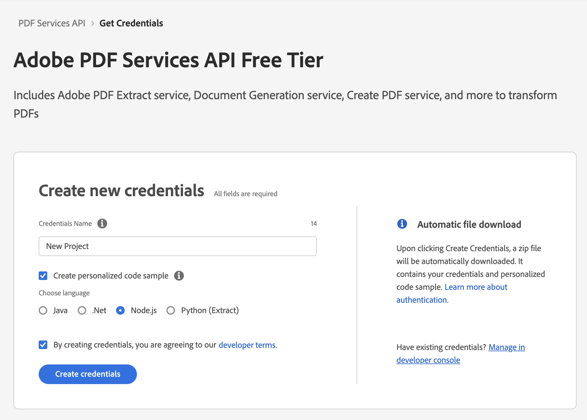
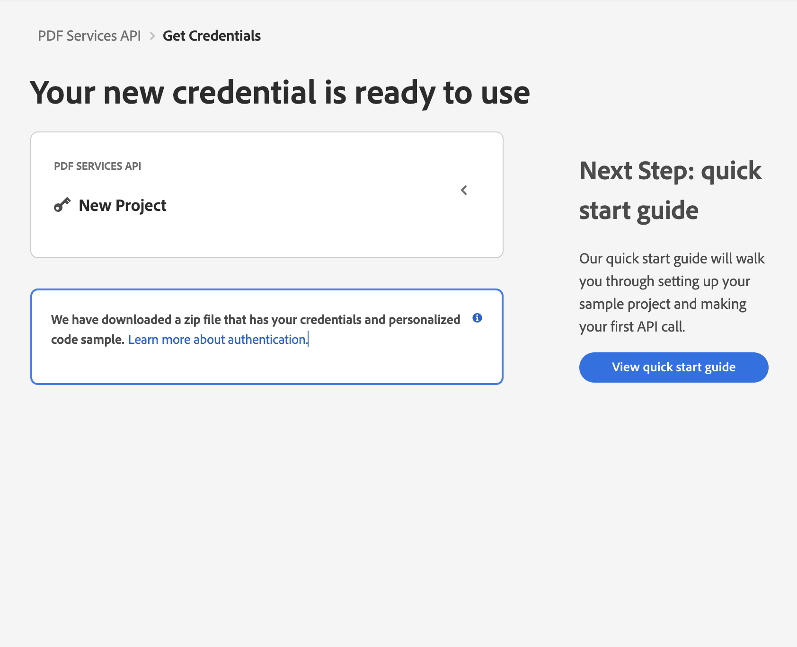
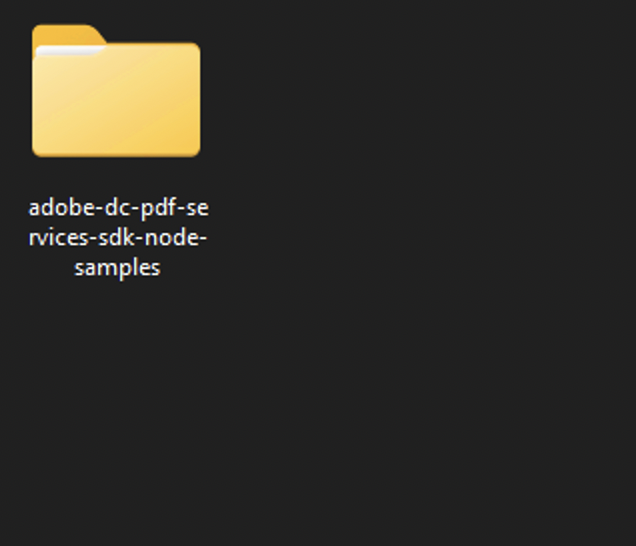
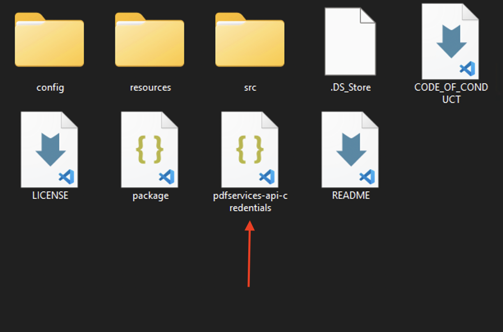
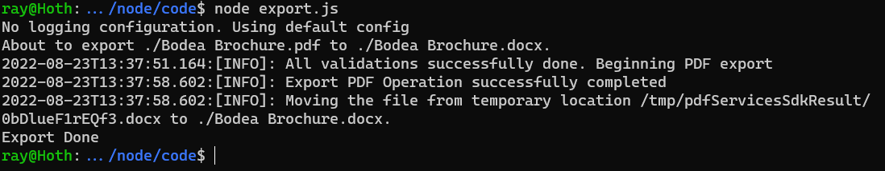

# Quickstart for Adobe PDF Services API (Node.js)

To get started using Adobe PDF Services API, let's walk through a simple scenario - taking an input PDF document and exporting it to Microsoft Word. In this guide, we will walk you through the complete process for creating a program that will accomplish this task. 

## Prerequisites

To complete this guide, you will need:

* [Node.js](https://nodejs.org) - Node.js version 14.0 or higher is required. 
* An Adobe ID. If you do not have one, the credential setup will walk you through creating one.
* A way to edit code. No specific editor is required for this guide.

## Step One: Getting credentials

1) To begin, open your browser to <https://documentservices.adobe.com/dc-integration-creation-app-cdn/main.html?api=pdf-services-api>. If you are not already logged in to Adobe.com, you will need to sign in or create a new user. Using a personal email account is recommend and not a federated ID.


2) After registering or logging in, you will then be asked to name your new credentials. Use the name, "New Project". 

3) Change the "Choose language" setting to "Node.js". 

4) Also note the checkbox by, "Create personalized code sample." This will include a large set of samples along with your credentials. These can be helpful for learning more later. 

5) Click the checkbox saying you agree to the developer terms and then click "Create credentials."



6) After your credentials are created, they are automatically downloaded:



## Step Two: Setting up the project

1) In your Downloads folder, find the ZIP file with your credentials: PDFServicesSDK-Node.jsSamples.zip. If you unzip that archive, you will a folder of samples:



2) We need the `pdfservices-api-credentials.json` file found in the samples directory:



<InlineAlert slots="text" />

3) Take the `pdfservices-api-credentials.json` file and place it in a new directory. Remember that this credential file is important and should be stored safely.

4) At the command line, change to the directory you created, and initialize a new Node.js project with `npm init -y`


5) Install the Adobe PDF Services Node.js SDK by typing `npm install --save @adobe/pdfservices-node-sdk` at the command line.

6) Install a package to help us work with ZIP files. Type `npm install --save adm-zip`.

At this point, we've installed the Node.js SDK for Adobe PDF Services API as a dependency for our project and have copied over our credentials files. 

Our application will take a PDF, `Bodea Brochure.pdf` (downloadable from <a href="https://documentcloud.adobe.com/view-sdk-demo/PDFs/Bodea Brochure.pdf">here</a>) and convert it to a Microsoft Word document, `Bodea Brochure.docx`.

7) In your editor, open the directory where you previously copied the credentials. Create a new file, `export.js`.

Now you're ready to begin coding.

## Step Three: Creating the application

1) We'll begin by including our required dependencies:

```js
const PDFServicesSdk = require('@adobe/pdfservices-node-sdk');
const fs = require('fs');
```

The first line includes the Adobe PDF Services Node.js SDK. The second third include Node's `filesystem` package. 

2) Now let's define our input and output:

```js
const OUTPUT = './Bodea Brochure.docx';

// If our output already exists, remove it so we can run the application again.
if(fs.existsSync(OUTPUT)) fs.unlinkSync(OUTPUT);

const INPUT = './Bodea Brochure.pdf';
```

These lines are hard coded but in a real application would typically be dynamic.

3) Next, we setup the SDK to use our credentials.

```js
const credentials = PDFServicesSdk.Credentials
        .servicePrincipalsCredentialsBuilder()
        .withClientId("CLIENT_ID")
        .withClientSecret("CLIENT_SECRET")
		.build();

// Create an ExecutionContext using credentials
const executionContext = PDFServicesSdk.ExecutionContext.create(credentials);
```

This code both points to the credentials downloaded previously as well as sets up an execution context object that will be used later.

4) Now, let's create the operation:

```js
// This creates an instance of the Export operation we're using, as well as specifying output type (DOCX)
const exportPdfOperation = PDFServicesSdk.ExportPDF.Operation.createNew(PDFServicesSdk.ExportPDF.SupportedTargetFormats.DOCX);

// Set operation input from a source file
const inputPDF = PDFServicesSdk.FileRef.createFromLocalFile(INPUT);
exportPdfOperation.setInput(inputPDF);
```

This set of code defines what we're doing (an Export operation), points to our local file and specifies the input is a PDF, and then defines options for the Export call. In this example, the only option is the export format, DOCX.

5) The next code block executes the operation:

```js
try {

	exportPdfOperation.execute(executionContext)
	.then(result => result.saveAsFile(OUTPUT))
	.then(() => {
		console.log('Export Done')
	})
	.catch(err => {
		console.log('Exception encountered while executing operation', err);
	});

} catch(err) {
	console.error('Error:', err);
}
```

This code runs the Export process and then stores the result Word document to the file system. 



Here's the complete application (`export.js`):

```js
const PDFServicesSdk = require('@adobe/pdfservices-node-sdk');
const fs = require('fs');

const OUTPUT = './Bodea Brochure.docx';

// If our output already exists, remove it so we can run the application again.
if(fs.existsSync(OUTPUT)) fs.unlinkSync(OUTPUT);

const INPUT = './Bodea Brochure.pdf';


console.log(`About to export ${INPUT} to ${OUTPUT}.`);

// Set up our credentials object.
const credentials =  PDFServicesSdk.Credentials
    .servicePrincipalsCredentialsBuilder()
    .withClientId("CLIENT_ID")
    .withClientSecret("CLIENT_SECRET")
	.build();

// An exectuionContext object wraps our credentials
const executionContext = PDFServicesSdk.ExecutionContext.create(credentials);

// This creates an instance of the Export operation we're using, as well as specifying output type (DOCX)
const exportPdfOperation = PDFServicesSdk.ExportPDF.Operation.createNew(PDFServicesSdk.ExportPDF.SupportedTargetFormats.DOCX);

// Set operation input from a source file
const inputPDF = PDFServicesSdk.FileRef.createFromLocalFile(INPUT);
exportPdfOperation.setInput(inputPDF);

try {

	exportPdfOperation.execute(executionContext)
	.then(result => result.saveAsFile(OUTPUT))
	.then(() => {
		console.log('Export Done')
	})
	.catch(err => {
		console.log('Exception encountered while executing operation', err);
	});

} catch(err) {
	console.error('Error:', err);
}
```

## Next Steps

Now that you've successfully performed your first operation, [review the documentation](https://developer.adobe.com/document-services/docs/overview/pdf-services-api/) for many other examples and reach out on our [forums](https://community.adobe.com/t5/document-services-apis/ct-p/ct-Document-Cloud-SDK) with any questions. Also remember the samples you downloaded while creating your credentials also have many demos.
