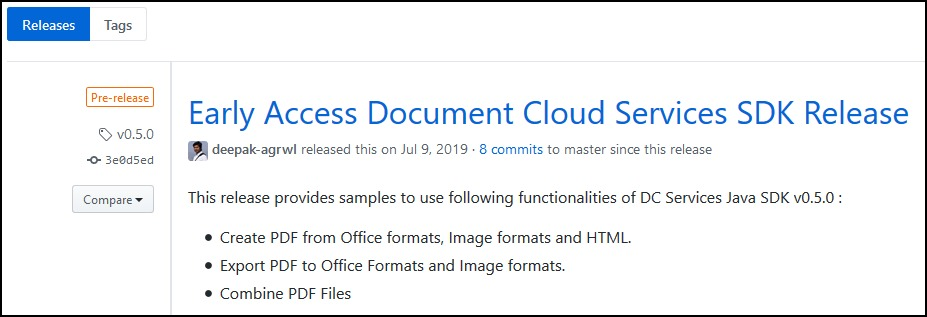

# Release Notes

This document describes the change history across releases for supported
versions. For details regarding versioning and support policies, see
[Version - Support policy](../pdf-services-api/policies.md).

## Supported versions

This document as well as the URLs on Adobe's website and other
documentation link to the latest product version.

**Note**: Links to repository assets (e.g. GIT, Maven, etc.) direct to
the top level directory. To download assets that match the
documentation, navigate to the correct version. For example, When using
the 1.0.0 Java documentation, you can find the 1.0.0 samples in the GIT
repo as follows:

1.  Go to the [GIT repo](https://www.adobe.com/go/pdftoolsapi_java_samples).
2.  Select *Releases*.
3.  Select and download the needed release.



## Migration Guide to PDF Services SDK

Refer to the following table for migrating to PDF Services SDK version
3.4.0, you can also refer our Samples(
[Java](https://www.adobe.com/go/pdftoolsapi_java_samples), [Node
JS](https://www.adobe.com/go/pdftoolsapi_node_sample),
[.NET](https://www.adobe.com/go/pdftoolsapi_net_samples)). for the
latest release.

<InlineAlert slots="text"/>

The 1.X.X versions of PDF Tools SDK will be reaching End of Life in
May 2022. Once a version reaches its end of life, functionality may be
deprecated and stop working. Please upgrade to use our latest SDK
version.

### Java changes

* `artifactId` changed from `pdftools-sdk` to `pdfservices-sdk`
* Replace the `<properties>` tag and SDK `<dependency>` tag in your project’s `pom.xml` file with the following:

```
<properties>
    <project.build.sourceEncoding>UTF-8</project.build.sourceEncoding>
    <maven.compiler.source>11</maven.compiler.source>
    <maven.compiler.target>11</maven.compiler.target>
    <pdfservices.sdk.version>4.1.0</pdfservices.sdk.version>
    <pdfservices.sdk.samples.version>4.1.0</pdfservices.sdk.samples.version>
</properties>

<dependency>
    <groupId>com.adobe.documentservices</groupId>
    <artifactId>pdfservices-sdk</artifactId>
    <version>${pdfservices.sdk.version}</version>
</dependency>
```

* Update import statements as per new Package structure. For e.g.

```
import com.adobe.pdfservices.operation.ExecutionContext; 
```

### Node JS changes

* NPM package name changed from `@adobe/documentservices-pdftools-node-sdk` to `@adobe/pdfservices-node-sdk`
* Update the latest SDK dependency in package.json file of your project
 
```
"@adobe/pdfservices-node-sdk": "4.0.1"
```

* Require the `@adobe/pdfservices-node-sdk` in the Sample file to access the SDK interface

```
const PDFServicesSdk = require('@adobe/pdfservices-node-sdk'); 
```

	
For HTML to PDF Conversions, the PageLayout object is moved inside html object. To access the PageLayout interface use the following code:

```
const pageLayout = new PDFServicesSdk.CreatePDF.options.html.PageLayout(); 
```

### .NET changes

* Nuget package name changed from `Adobe.DocumentServices.PDFTools` to `Adobe.PDFServicesSDK`
* Update the SDK dependency in your project’s .csproj file with the following:

```
<ItemGroup>
    <PackageReference Include="log4net" Version="2.0.17" />
    <PackageReference Include="Adobe.PDFServicesSDK" Version="4.0.0" />
</ItemGroup> 
```

* Update the namespaces accordingly in your .cs file as per the new dependency: 
```javascript
using Adobe.PDFServicesSDK;
```  

### Python changes

* Add the following dependency in your project’s requirements.txt file:

```
pdfservices-sdk~=4.0.0
```


## Archived Documentation

The last major version of our documentation may be found [here](../legacy-documentation/).


## Change types

Change types include the following:

-   **New**: Features or implementation changes added in the current
 release.
-   **Changed**: Modified code that changes a feature or implementation
 detail.
-   **Security**: A patch or bug fixed released in an out-of-band patch.
-   **Deprecated**: Existing functionality for which support is ending
 (or ended).

<InlineAlert slots="text" />

Minor and Patch releases are backward compatible with the previous release.
Upgrading to the latest SDK should not break existing applications.

## Change history

### 4.0.0 (July 22, 2024; major release)

| Change  | Language  | Description                                                                                                                        |
|---------|-----------|------------------------------------------------------------------------------------------------------------------------------------|
| New     | .NET      | Released Adobe PDF Services .NET SDK v4.0.0, introducing new interfaces fully leveraging power of new PDF Services rest APIs.      |
| New     | .NET      | Added support for delete asset, refresh download URI and webhook notifiers.                                                        |
| New     | .NET      | Eliminated need of storage to save intermediate result by removing dependency on temporary storage.                                |
| New     | .NET      | Extended I/O capabilities by introducing external storage for PDF Services operations.                                             |
| New     | .NET      | Enabled connection to Internet through Proxy, where proxy server settings can be set via "proxyServerConfig" in the client config. |
| Changed | .NET      | Updated PDF Properties operation to return PDFProperties object along with JSON string.                                            |
| Changed | .NET      | Updated Extract PDF operation to return content and resource asset along with content JSON object.                                 |

### 4.0.1 (June 12, 2024; patch release)

| Change  | Language | Description                           |
|---------|----------|---------------------------------------|
| Changed | NodeJS   | Bug fixes and stability improvements. |

### 3.5.1 (June 05, 2024; patch release)

| Change  | Language | Description                           |
|---------|----------|---------------------------------------|
| Changed | .NET     | Bug fixes and stability improvements. |

### 4.1.0 (June 04, 2024: minor release)

| Change | Language | Description                                                      |
|--------|----------|------------------------------------------------------------------|
| New    | Java     | Extend support for external storage and notifier config for all the operations. |


### 4.0.0 (May 22, 2024; major release)

| Change  | Language | Description                                                                                                                     |
|---------|----------|---------------------------------------------------------------------------------------------------------------------------------|
| New     | Python   | Released Adobe PDF Services Python SDK v4.0.0, introducing new interfaces fully leveraging power of new PDF Services REST APIs. |
| New     | Python   | Added support for all the operations powered by the Adobe PDF Services APIs.                                                    |
| New     | Python   | Added support for deleting assets and webhook notifiers.                                                                        |
| New     | Python   | Removed the need for intermediate result storage for chained operations by eliminating reliance on temporary local storage.     |
| New     | Python   | Extended I/O capabilities by introducing external storage for PDF Services operations.                                          |
| New     | Python   | Enabled connection to Internet through Proxy, where proxy server settings can be set via Proxy Server Config.                   |

### 3.5.0 (May 15, 2024: minor release)

| Change | Language | Description                                                                                                                                                                                                                                                                                                                               |
|--------|----------|-------------------------------------------------------------------------------------------------------------------------------------------------------------------------------------------------------------------------------------------------------------------------------------------------------------------------------------------|
| New    | .NET     | Added support to enable or disable "configureAwait" using client config, which will allow developers to specify whether asynchronous continuations should execute on the original synchronization context or not. **Note**: Starting from the next major release, "configureAwait" will be disabled by default and won't be configurable. |


### Adobe Document Generation Server Side Release (April 30, 2024: server side release)

| Change  | Language | Description                                                                                                                                                                                                  |
|---------|----------|--------------------------------------------------------------------------------------------------------------------------------------------------------------------------------------------------------------|
| New | All      | Added support for [discard the row in a horizontal table](../document-generation-api/tablewithmarkers/#discard-the-row-in-a-horizontal-table-if-the-condition-evaluates-to-true) in Document Generation API. |

### 4.0.0 (April, 2024; major release)

| Change  | Language | Description                                                                                                                        |
|---------|----------|------------------------------------------------------------------------------------------------------------------------------------|
| New     | NodeJS   | Released Adobe PDF Services Node SDK v4.0.0, introducing new interfaces fully leveraging power of new PDF Services rest APIs.      |
| New     | NodeJS   | Added support for delete asset and webhook notifiers.                                                                              |
| New     | NodeJS   | Eliminated need of storage to save intermediate result by removing dependency on temporary storage.                                |
| New     | NodeJS   | Extended I/O capabilities by introducing external storage for PDF Services operations.                                             |
| New     | NodeJS   | Enabled connection to Internet through Proxy, where proxy server settings can be set via "proxyServerConfig" in the client config. |
| Changed | NodeJS   | Updated PDF Properties operation to return PDFProperties object along with JSON string.                                            |
| Changed | NodeJS   | Updated Extract PDF operation to return content and resource asset along with content JSON object.                                 |

### Server Side Release (April, 2024; server side release)

| Change | Language | Description                                                                                                                                                 |
|--------|----------|-------------------------------------------------------------------------------------------------------------------------------------------------------------|
| New    | API     | Added support for [Webhook Notification](../pdf-services-api/howtos/webhook-notification/) in PDF Properties.                                               |
| New    | API     | Added support for [External Storage](../pdf-services-api/howtos/pdf-external-storage-sol/) in Extract PDF, Split PDF, PDF Electronic Seal and Auto-Tag PDF. |
| New    | API     | Added support for [Webhook Notification](../pdf-services-api/howtos/webhook-notification/) for external storage operations.                                 |

### 2.3.1 (March, 2024; patch release)

| Change  | Language         | Description                                                                                                                     |
|---------|------------------|---------------------------------------------------------------------------------------------------------------------------------|
| New | Python | PDF operations now support configurable timeouts. |

### 3.4.1 (February, 2024: patch release)

| Change  | Language | Description                                                                     |
|---------|----------|---------------------------------------------------------------------------------|
| Changed | .NET     | Dependent library upgrades and fixed compatibility issues with RestSharp v110+. |


### 4.0.0 (January, 2024; major release)
| Change  | Language | Description                                                                                                                   |
|---------|----------|-------------------------------------------------------------------------------------------------------------------------------|
| New     | Java     | Released Adobe PDF Services Java SDK v4.0.0, introducing new interfaces fully leveraging power of new PDF Services rest APIs. |
| New     | Java     | Added support for delete asset, refresh download URI, webhook notifiers.                                                      |
| New     | Java     | Eliminated need of storage to save intermediate result by removing dependency on temporary storage.                           |
| New     | Java     | Extended I/O capabilities by introducing external storage for a majority of PDF Services operations.                          |
| Changed | Java     | Updated PDF Properties operation to return PDFProperties object along with JSON string.                                       |
| Changed | Java     | Updated Extract PDF operation to return content and resource asset along with content JSON object.                            |


### Server Side Release (January, 2024; server side release)

| Change | Language | Description                                                                                                                                                                                                                           |
|--------|----------|---------------------------------------------------------------------------------------------------------------------------------------------------------------------------------------------------------------------------------------|
| New    | API     | Added support for [Webhook Notification](../pdf-services-api/howtos/webhook-notification/) in all the operations **except** PDF Properties. |

### Adobe Document Generation Server Side Release (January, 2024: server side release)

| Change  | Language | Description                                                                                            |
|---------|----------|--------------------------------------------------------------------------------------------------------|
| Changed | All      | Added support for [Table Tag with Markers](../document-generation-api/tablewithmarkers) in Document Generation API. |

### 3.5.1 (December, 2023: patch release)

| Change  | Language | Description                                                                      |
|---------|----------|----------------------------------------------------------------------------------|
| Changed | Java     | Dependent library upgrades and fixed compatibility issues with Spring Boot v3.x. |


### 3.5.0 (October, 2023: minor release)

| Change  | Language | Description                                                                                                                                                                                                                            |
|---------|----------|----------------------------------------------------------------------------------------------------------------------------------------------------------------------------------------------------------------------------------------|
| Changed | Java     | Added support for document level permissions and trusted timestamping (using [supported TSAs](../pdf-electronic-seal-api/#supported-timestamping-authorities)) in java sdk for [PDF Electronic Seal API](../pdf-electronic-seal-api/). |

### Adobe Document Generation Server Side Release (October, 2023; server side release)

| Change  | Language | Description                                                                                                       |
|---------|----------|-------------------------------------------------------------------------------------------------------------------|
| Changed | All      | Performance Improvements - Available in [REST API](../apis/#tag/Document-Generation) and SDK(s) v3.0.0 and above. |

### Server Side Release (August, 2023; server side release)

| Change | Language | Description                                                                                                              |
|--------|----------|--------------------------------------------------------------------------------------------------------------------------|
| New    | API     | Added support for document level permissions and trusted timestamping (using [supported TSAs](../pdf-electronic-seal-api/#supported-timestamping-authorities)) in [PDF Electronic Seal API](../pdf-electronic-seal-api/).   |
| New    | API     | Added support for [External Storage](../pdf-services-api/howtos/pdf-external-storage-sol/) in all the operations **except** Extract PDF, Split PDF, PDF Electronic Seal and Auto-Tag PDF. |

### 3.4.2 (August, 2023, minor release)

| Change  | Language | Description                       |
|---------|----------|-----------------------------------|
| Changed | NodeJS      | Restructured the internals for improved organization. |

### 3.4.1 (July, 2023, minor release)

| Change  | Language | Description                    |
|---------|----------|--------------------------------|
| Changed | NodeJS      | Fixed links in README.md file. |

### 3.4.0 (June, 2023; minor release)

| Change | Language         | Description                                                                                                                                      |
|--------|------------------|--------------------------------------------------------------------------------------------------------------------------------------------------|
| New    | Java,NodeJS,.NET | PDF Electronic Seal operation is now available for all the users in PDF Services SDKs and REST APIs.                                             |
| New    | Java,NodeJS,.NET | Added support for OAuth based Server to Server credentials in PDF Services SDKs. |
| Changed | Java,NodeJS,.NET | JWT based service account credentials and corresponding SDK interfaces are now deprecated. |

### Python SDK 2.3.0 (June, 2023; minor release)

| Change  | Language         | Description                                                                                                                     |
|---------|------------------|---------------------------------------------------------------------------------------------------------------------------------|
| New | Python | Added support for OAuth based Server to Server credentials in PDF Services SDKs. |
| Changed | Python | JWT based service account credentials and corresponding SDK interfaces are now deprecated. |

### Adobe Document Generation Server Side Release (June, 2023; server side release)

| Change | Language | Description                                                                                                              |
|--------|----------|--------------------------------------------------------------------------------------------------------------------------|
| New    | API     | Added support for [External Storage](../pdf-services-api/howtos/pdf-external-storage-sol/) in Document Generation API.   |

### 3.3.0 (May, 2023; minor release)

| Change  | Language         | Description                                                                                                                     |
|---------|------------------|---------------------------------------------------------------------------------------------------------------------------------|
| New | Java,NodeJS,.NET | PDF Accessibility Auto-Tag operation is now available for all the users in PDF Services SDKs and REST APIs.  |
| New | Java | Added the support of Basic Authentication for the Proxy Server configuration. Proxy server settings will now be specified via "proxyServerConfig" in the client config. |
| Changed | Java,NodeJS,.NET | Upgraded third party libraries to fix recently discovered vulnerabilities. |

### Python SDK 2.2.0 (May, 2023; minor release)

| Change  | Language         | Description                                                                                                                     |
|---------|------------------|---------------------------------------------------------------------------------------------------------------------------------|
| New | Python | PDF Accessibility Auto-Tag operation is now available for all the users in PDF Services SDKs and REST APIs. |

### Extract PDF Server Side Release (06 March, 2023; server side release)
| Change  | Language            | Description                                                                                   |
| ------- | ------------------- | --------------------------------------------------------------------------------------------- |
| Changed | All                 | Adding support for larger PDF document processing. The new supported limits are 400 pages for non-scanned and 150 for scanned PDF documents. |

### 2.3.0 (February, 2023, minor release)

| Change  | Language | Description                                                                                                                  |
|---------|----------|------------------------------------------------------------------------------------------------------------------------------|
| Changed | NodeJS      | Fixed the response failures with `400` HTTP statusCode  and `UNKNOWN` errorCode for NodeJS SDK(s) v2.2.3 and below.               |

### Adobe Document Generation Server Side Release (January, 2023, server side release)

| Change  | Language | Description                                                                                                                  |
|---------|----------|------------------------------------------------------------------------------------------------------------------------------|
| New     | Java,NodeJS,.NET      | Adding support for [inline images](../document-generation-api/inlineimages.md#) feature.                                     |
| New     | Java,NodeJS,.NET      | Adding support for additional constructs in [fragments](../document-generation-api/fragments.md#Other-supported-constructs). |
| Changed | Java,NodeJS,.NET      | Adding support for prefix in [text tags](../document-generation-api/templatetags.md#Placeholder-Variables).                  |

### Python SDK 2.1.2 (January, 2023, minor release)
| Change  | Language            | Description                                                                                   |
| ------- | ------------------- | --------------------------------------------------------------------------------------------- |
| New | Python                 | Added configuration for SDKs to process the documents in the specified region.|
| Changed| Python               | Upgraded libraries to fix recently discovered vulnerability. |


### 3.4.0 (January, 2023; minor release)
| Change  | Language            | Description                                                                                   |
| ------- | ------------------- | --------------------------------------------------------------------------------------------- |
| New     | Java,NodeJS,.NET                 | Added configuration for SDKs to process the documents in the specified region.                |
| Changed     | NodeJS                | Upgraded libraries to fix recently discovered vulnerability..                          |

### Python SDK 2.0.0 (December, 2022, major release)
| Change  | Language            | Description                                                                                   |
| ------- | ------------------- | --------------------------------------------------------------------------------------------- |
| Changed | Python                 | Released SDK v2.0.0 for Python, based out of the new PDF Services APIs.                                       |


### 3.0.0 (September, 2022; major release)
| Change  | Language            | Description                                                                                   |
| ------- | ------------------- | --------------------------------------------------------------------------------------------- |
| Changed | Java,NodeJS,.NET    | Released SDK v3.0.0, based out of the new PDF Services APIs.|
| Changed | Java,NodeJS,.NET    | Added the support of OCR locale for Export PDF operation. |
| Changed | Java,NodeJS,.NET    | Updated PDF Properties operation to return PDFProperties object. Discontinued the support of returning FileRef and JSON Object.|
| Changed | Java,NodeJS,.NET    | Image formats(JPEG and PNG) for Export PDF have been moved from Export PDF operation to ExportPDFToImages operation.|
| New     | Java                | PDF Electronic Seal operation is now available in Beta PDF Services SDKs.|


### 2.2.3 (July, 2022; patch release)
| Change  | Language            | Description                                                                                   |
| ------- | ------------------- | --------------------------------------------------------------------------------------------- |
| Changed | NodeJS              | Fixed the issue of sending UNKNOWN error code for extract operation.

### PDF Accessibility Auto-Tag Release - Available under Early Access Program (21 June, 2022)
| Change  | Language            | Description                                                                     |
| ------- | ------------------- |---------------------------------------------------------------------------------|
| New     | Java, Python        | PDF Accessibility Auto-Tag operation is now available in Beta PDF Services SDKs |

### Extract PDF Server Side Release (21 June, 2022; server side release)
| Change  | Language            | Description                                                                                   |
| ------- | ------------------- | --------------------------------------------------------------------------------------------- |
| Changed | All                 | Enhanced error messages by adding more sub error codes							            |
| Changed | All                 | Bug fixes and stability improvements.								|

### Extract PDF Server Side Release (16 May, 2022; server side release)
| Change  | Language            | Description                                                                                   |
| ------- | ------------------- | --------------------------------------------------------------------------------------------- |
| Changed | All                 | Bug fixes and stability improvements.								|

### 2.2.2 (May, 2022; patch release)
| Change  | Language            | Description                                                                                   |
| ------- | ------------------- | --------------------------------------------------------------------------------------------- |
| Changed | Java, NodeJS               | Dependent library upgrades to address vulnerabilities reported in NPM and Maven.                                               |

### Create PDF Server Side Release (6 April, 2022; server side release)
| Change  | Language            | Description                                                                                   |
| ------- | ------------------- | --------------------------------------------------------------------------------------------- |
| Changed | All                 | Enhanced support for leveraging embedded TrueType fonts.                                               |

### Extract PDF Server Side Release (05 April, 2022; server side release)
| Change  | Language            | Description                                                                                   |
| ------- | ------------------- | --------------------------------------------------------------------------------------------- |
| Changed | All                 | Improved handling of bad PDFs with 50% reduction in frequency of bad PDF errors and improved successful conversion rate.                                                        |
| Changed | All                 | Bug fixes and stability improvements.                                                         |

### 2.2.1 (March, 2022; patch release)
| Change  | Language            | Description                                                                                   |
| ------- | ------------------- | --------------------------------------------------------------------------------------------- |
| Changed | .NET                | Dependent library upgrades and SDK internal additional validation checks.  |

### Extract PDF Server Side Release (22 February, 2022; server side release)
| Change  | Language            | Description                                                                                   |
| ------- | ------------------- | --------------------------------------------------------------------------------------------- |
| Changed | All                 | Adding support for identification of scanned pages with "is_scanned" field in Extract output. |
| Changed | All                 | Bug fixes and stability improvements.                                                         |

### 2.2.1 (February, 2022; patch release)

| Change  | Language            | Description                                                                                                                                                   |
| ------- | ------------------- | --------------------------------------------------------------------------------------------------------------------------------------------------------------|
| Changed | Java                | Dependent library upgrades.  |


### 2.2.1 (January, 2022; patch release)

| Change  | Language            | Description                                                                                                                                                   |
| ------- | ------------------- | --------------------------------------------------------------------------------------------------------------------------------------------------------------|
| Changed | Node JS             | Enhanced Document Generation interface to support Json Object and Json array as Fragments data.   |

### 2.2.0 (January, 2022; minor release)

| Change  | Language            | Description                                                                                                                                                   |
| ------- | ------------------- | --------------------------------------------------------------------------------------------------------------------------------------------------------------|
| New     | All                 | Adding support for [fragments](../document-generation-api/fragments.md#) feature.                                                                             |
| Changed | Java                | Java SDK is enabled to connect to Internet through Proxy where proxy server settings can be set via client config. |
| Changed | All                 | PDF Extract API bug fixes and stability release. |

### Adobe Document Generation Server Side Release (10 January, 2022; server side release)

| Change  | Language | Description                                                                                                                                                              |
| ------- | -------- | -------------------------------------------------------------------------------------------------------------------------------------------------------------------------|
| New     | All      | Adding support for [fragments](../document-generation-api/fragments.md#) feature.                                                                                        |
| Changed     | All      | Adding support to add [images](../document-generation-api/templatetags.md#images) (only base64 encoded image data was supported initially) through publicly accessible URLs.     |
| Changed     | All      | Adding support for primitive type [list](../document-generation-api/templatetags.md#lists)

### Adobe Document Generation Server Side Release (14 December, 2021; server side release)

| Change  | Language | Description                                                                                                                                                              |
| ------- | -------- | -------------------------------------------------------------------------------------------------------------------------------------------------------------------------|
| New     | All      | Adding support for additional tags (<strong\> and <em\>) in [styling and formatting](../document-generation-api/stylingformattingtags.md#apply-styling-and-formatting) feature.                                                                               |
| New     | All      | Support for [dynamic table constructs](../document-generation-api/complextableconstructs.md).     |

### Extract PDF Server Side Release (15 November, 2021; server side release)
| Change  | Language            | Description                                                                                    |
| ------- | ------------------- | ---------------------------------------------------------------------------------------------- |
| Changed | All                 | The option to include styling information is generally available.                              |
| Changed | All                 | Identification of scanned content is now performed at the page level rather than per document. |
| Changed | All                 | Bug fixes and stability improvements.                                                          |

### Adobe Document Generation Server Side Release (20 October, 2021; server side release)

| Change  | Language | Description                                                                                                                                                   |
| ------- | -------- | ------------------------------------------------------------------------------------------------------------------------------------------------------------------ |
| New     | All      | HTML [styling and formatting](../document-generation-api/stylingformattingtags.md#apply-styling-and-formatting) support in json data.                                                                               |
| New     | All      | Support for [horizontal tables](../document-generation-api/templatetags.md#dynamically-expand-table-rows-or-columns).     |
| New     | All      | Support for SVG images.                                                                               |

### Extract PDF Server Side Release (29 September, 2021; server side release)
| Change  | Language            | Description|
| ------- | ------------------- | ---------- |
| Changed | All                 | Support for more descriptive error messages and PDF Extract API bug fixes. |

### 2.1.0 (September, 2021; minor release)

| Change  | Language            | Description                                                                                                                                                   |
| ------- | ------------------- | ------------------------------------------------------------------------------------------------------------------------------------------------------------------ |
| New     | .NET                | Extract operation is now available in .NET SDK as part of **Adobe.PDFServicesSDK**.                                                                                |
| New     | Java, Node JS, .NET | Support for fetching the properties of a PDF file - metadata including page count, PDF version, file size, compliance levels, font info, permissions and more.     |
| New     | Java, Node JS, .NET | Support for returning the list of images besides returning ZIP of all image files.                                                                                 |
| New     | Java, Node JS, .NET | Support for converting the content hosted on a URL to PDF files.                                                                                                   |
| New     | Java, Node JS, .NET | Support for converting an HTML file containing inline CSS to PDF files.                                                                                            |

### Extract PDF Server Side Release (26 Aug, 2021; server side release)
| Change  | Language            | Description                                     |
| ------- | ------------------- | ----------------------------------------------- |
| Changed | All                 | PDF Extract API bug fixes and stability release |

### 2.0.0 (May, 2021; major release)

| Change  | Language | Description                                                                                                    |
| ------- | -------- | -------------------------------------------------------------------------------------------------------------- |
| New     | All      | Extract operation released as part of **pdfservices-sdk**                                                      |
| Changed | Java     | artifactId changed from pdftools-sdk to **pdfservices-sdk**                                                    |
| Changed | Node JS  | NPM package name changed from @adobe/documentservices-pdftools-node-sdk to **@adobe/pdfservices-node-sdk**     |
| Changed | Node JS  | For HTML to PDF Conversions, the PageLayout object interface is moved inside html object.                      |
| Changed | .NET     | Nuget package name changed from Adobe.DocumentServices.PDFTools to **Adobe.PDFServicesSDK**                    |
| New     | Python   | Python SDK “pdfservices-sdk” v1.0 is released for ML Services which consists of ExtractPDFOperation currently. |

### 1.3.0 (March, 2021; minor release)

| Change | Language | Description                                                                                                                                                      |
| ------ | -------- | ---------------------------------------------------------------------------------------------------------------------------------------------------------------- |
| New    | All      | Added a feature to the create PDF operation to specify the document language of input file.                                                                      |
| New    | All      | Added Document Merge Operation that merges a Word based document template with the input JSON data to generate the output document in either Word or PDF format. |
| New    | All      | Added support to get the developer error codes in exceptions.                                                                                                    |
| New    | All      | Added a feature to the compress PDF operation to reduce the file size based on compression level.                                                                |

### 1.2.0 (September, 2020; minor release)

| Change | Language | Description                                                                                                                                                               |
| ------ | -------- | ------------------------------------------------------------------------------------------------------------------------------------------------------------------------- |
| New    | All      | Added more features to the password-protect operation to secure a PDF with an owner password and to enable users to restrict features like printing, editing and copying. |
| New    | All      | Added an operation for removing password protection from a PDF.                                                                                                           |
| New    | All      | Added a split PDF operation that splits a PDF document into multiple smaller documents by simply specifying either the number of files, pages per file, or page ranges.   |

### 1.1.0 (June, 2020; minor release)

| Change  | Language | Description                                                                                                                     |
| ------- | -------- | ------------------------------------------------------------------------------------------------------------------------------- |
| New     | All      | Added a password-protect operation to securely open a PDF.                                                                      |
| New     | All      | Added an operation for inserting a PDF file into an existing PDF.                                                               |
| New     | All      | Added a replace file operation which replaces a PDF with another.                                                               |
| New     | All      | Added an operation for deleting pages from a PDF.                                                                               |
| New     | All      | Added a rotate page(s) operation for rotating one or more pages in a PDF.                                                       |
| New     | All      | Added reorder page(s) operation to support rearranging page(s) in a PDF.                                                        |
| New     | All      | Added a compress PDF operation to reduce a PDF file size.                                                                       |
| New     | All      | Added a linearize operation to convert a PDF file into a web optimized PDF file for incremental access in network environments. |
| Changed | All      | Changed the combine file limit from 12 to 20.                                                                                   |

### 1.0.0 (March, 2020; First major release)

| Change | Language | Description                                                                                                                                                  |
| ------ | -------- | ------------------------------------------------------------------------------------------------------------------------------------------------------------ |
| New    | All      | Added create PDF operation to create PDF from Office formats, image formats and HTML (doc, docx, ppt, pptx, xls, xlsx, txt, rtf, bmp, gif, tiff, jpeg, png). |
| New    | All      | Added export PDF operation to export PDF to Office formats and image formats (doc, docx, pptx, rtf, xlsx, jpeg, png).                                        |
| New    | All      | Added combine PDF files operation.                                                                                                                           |
| New    | All      | Added an OCR operation to convert PDF files into a searchable PDF.                                                                                           |
