## VIP MP Onboarding Guide
This is an onboarding guide for our Value Incentive Program (VIP) Marketplace Customers. This guide includes: 

- Prerequisites (IT Administrator)
- Creating credentials and using Acrobat Services (Developer)
- Getting support for Acrobat Services
- Developer resources

Before getting started, review the prerequisites below and ensure they are complete.

## Prerequisites (IT Administrator)

1. Log into your [VIP Admin Console](https://adminconsole.adobe.com/) and make sure the "Acrobat Services API - DOC TRANS PACK" product is listed in available products, like the example below. 

   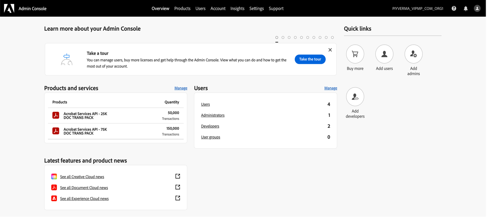

2. Click on “Add Developers” under Quick links section. Alternatively, click on the "Manage" link in Users section, then click on "Developers" card and then click on "Add Developers" button.

   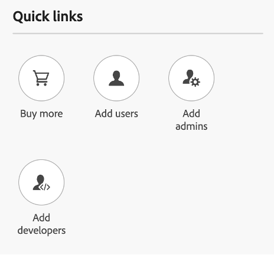

   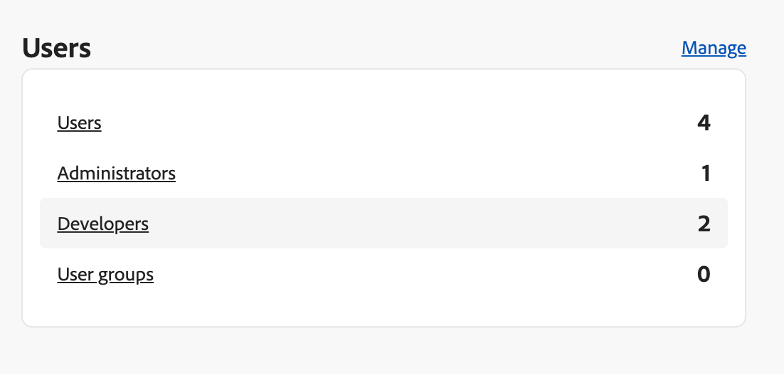

3. When adding the developer, make sure that "Acrobat Services API - DOC TRANS PACK" is selected as the product. 

   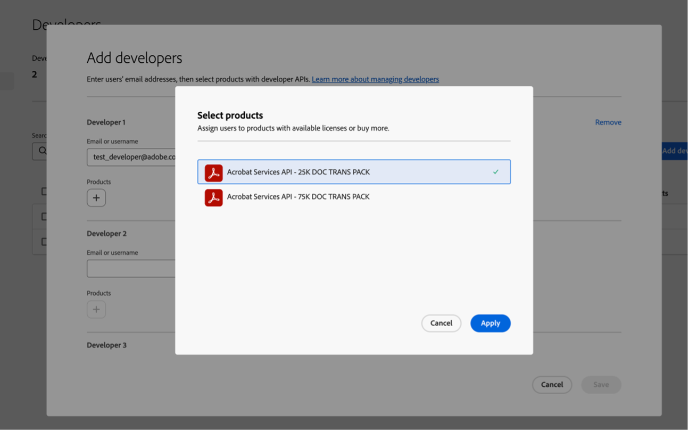

   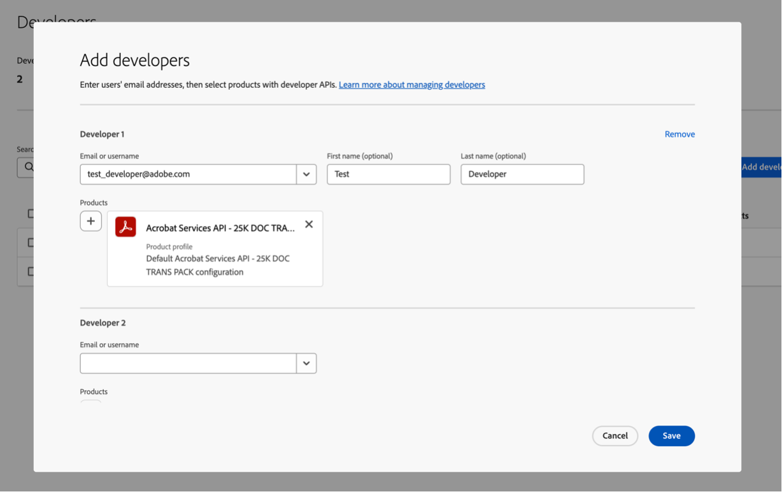

4. When you are done selecting, click save.

Once these are in place, developers can self-create the credentials (using the steps below) to use the Adobe Acrobat Services API in a production environment.

## Creating credentials and using Adobe Acrobat Services (Developer)

1. Go to the [Adobe Developer Console](https://developer.adobe.com/console/).

   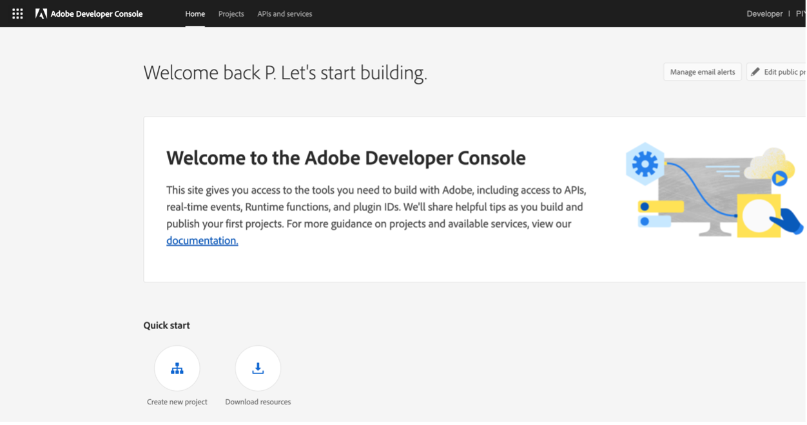

2. Sign In/Sign Up with the Adobe ID assigned to the product.

3. Click on "Create new project" under Quick Start section.

   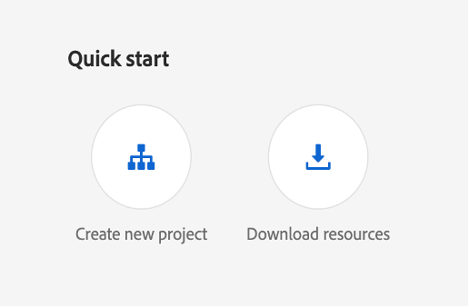

4. Click on "Add API" on the next page.

   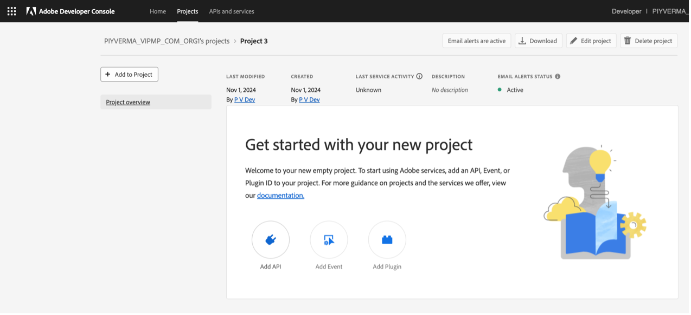

5. Select “Document Cloud” and then "Adobe Acrobat Services API - VIP" product and click on "Next".

   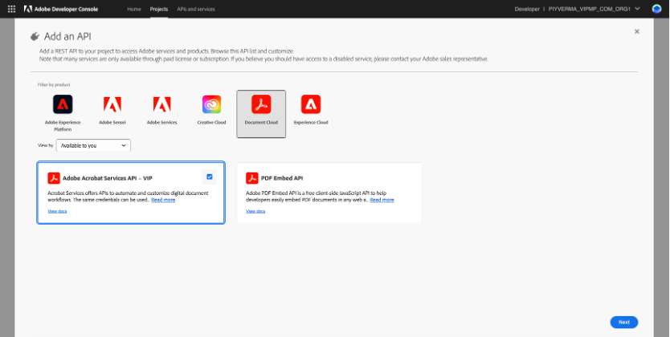

6. Enter the name of your credential and click Next.

   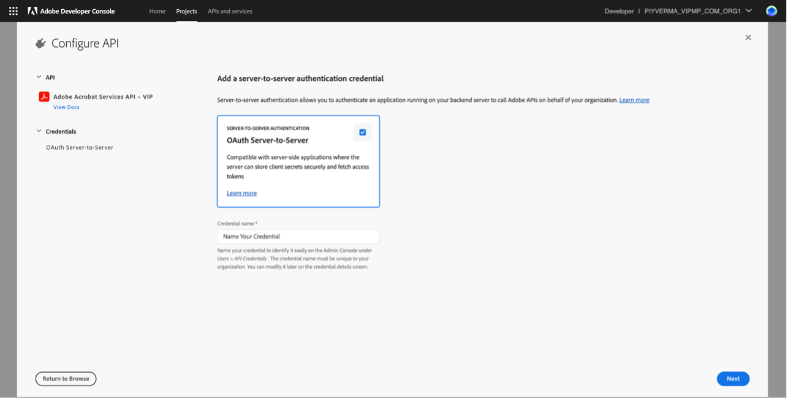

7. Select the Product Profile and Click on "Save Configured API".

   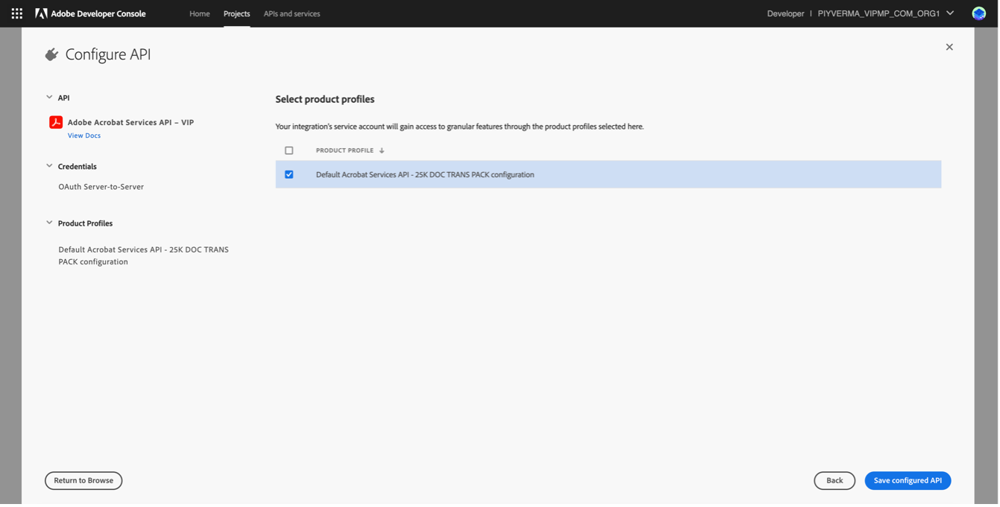

8. After this, credentials will be created, and you can start using the credentials to invoke the APIs using the API Documentation available [here](https://developer.adobe.com/document-services/docs/apis/).

## Getting support for Adobe Acrobat Services

Please follow the steps below to create and manage your support ticket through our Admin Console: 
A designated Administrator or Support Admin for your Enterprise account needs to sign in to the Admin Console and navigate to Support. To resolve or discuss a case, you can call Adobe Customer Care using the contact number given on the upper-right corner of the page. If the country mentioned below the phone number does not match yours, click Other Regions for more contact numbers. To learn about our support terms and processes, see Enterprise Support Terms. 
The initial response time is one business day. Adobe makes the best effort to respond in a timely fashion, though it
doesn’t guarantee a resolution to any issue or fix bugs in a particular timeframe.

### Create a Support Case

To create a case, do the following:

1. In the Admin Console, navigate to **Support > Support Summary**.

2. Click **Create Case**. The **Create Case** window appears. 

   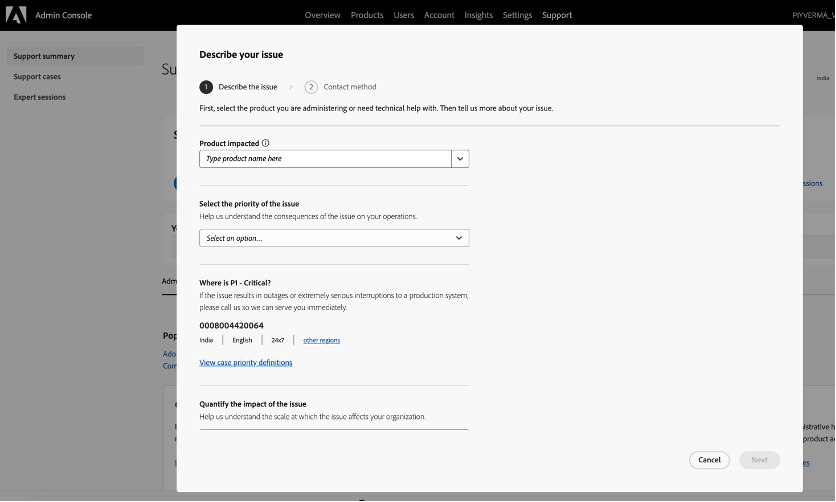

3. Select the Product Impacted.

   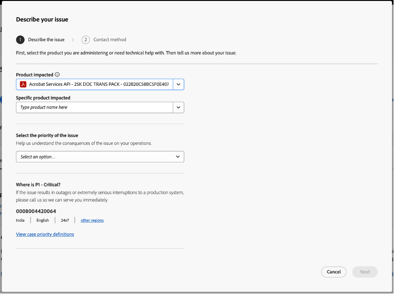

4. Select the Specific Product Impacted as “Acrobat Services API”.

5. Provide more details about your issue in the window that appears.

   | **Details to be filled**                                                    | **Description**                                                                                                                                                                                                                                                                                                                                                                                                                                                                                                                                                                                                                                                                                                                                                                        |
   |-----------------------------------------------------------------------------|----------------------------------------------------------------------------------------------------------------------------------------------------------------------------------------------------------------------------------------------------------------------------------------------------------------------------------------------------------------------------------------------------------------------------------------------------------------------------------------------------------------------------------------------------------------------------------------------------------------------------------------------------------------------------------------------------------------------------------------------------------------------------------------|
   | **Specify the product impacted**                                            | Specify the name of the product in the given field. To see a list of options, type the first few letters of the product name. This option is not available if you create a case for managing users and licenses.                                                                                                                                                                                                                                                                                                                                                                                                                                                                                                                                                                       |
   | **Select the specific product impacted**                                    | Select "Acrobat Services API".                                                                                                                                                                                                                                                                                                                                                                                                                                                                                                                                                                                                                                                                                                                                                         |
   | **Select the issue Reason**                                                 | Select the appropriate reason of the issue using the dropdown list.                                                                                                                                                                                                                                                                                                                                                                                                                                                                                                                                                                                                                                                                                                                    |
   | **Select the priority of the issue**                                        | Depending on how the issue impacts your operations, classify it as follows: o **P4 (Minor)**: Select this option if the issue does not cause any significant interruptions to normal operations. This option can include issues related to APIs and integration, installation and configuration inquiries, enhancement requests, or documentation questions. o **P3 (Important)**: If the issue interrupts normal operations, select this option. For example, malfunctioning or incorrect behavior of the software. o **P2 (Urgent)**: Choose this option when there are serious interruptions to your business' normal operations. For example, if the issue negatively impacts an enterprise-wide installation, urgent deadlines, or causes financial risk to business. |
   | **Quantify the impact of the issue**                                        | Based on the scale at which the issue affects your organization, select one from the following options: o **Small:** One or two users impacted o **Medium:** A specific group of users impacted o **Large:** Most users impacted.                                                                                                                                                                                                                                                                                                                                                                                                                                                                                                                                          |
   | **Summarize the issue**                                                     | Provide a descriptive summary of your issue. Mention what the specific problem is and what you are seeing. Examples of descriptive summaries: o Error "Could not process incoming SAML response" with Federated ID o "Account not recognized" in the support panel o Error 400 or other error when attempting to validate a domain claim o Users, groups, or identity panel is blank o Change Domain Claim from Enterprise ID to Federated (or conversely) o Receiving the error "An invitation with this code was not found".                                                                                                                                                                                                                             |
   | **Describe the nature of the issue you're facing**                          | State your queries or describe your issue in detail, including the workflow that caused the issue and steps to reproduce. Include details about when it first happened.                                                                                                                                                                                                                                                                                                                                                                                                                                                                                                                                                                                                                |
   | **Attach screenshots or files that can help describe the issue (optional)** | You can attach relevant files under 20 MB to the case. For example, a screenshot of the error. Executable and DLL files are not supported.                                                                                                                                                                                                                                                                                                                                                                                                                                                                                                                                                                                                                                             |

<InlineAlert slots="text"/>

**Note:** If the issue results in outages or serious interruptions to a production system such as the following,
call Adobe Customer using the contact number given on the upper-right corner of the Support Summary page. 
o A complete crash of the system or interruptions in main functions of the production system. 
o Data integrity compromised. 
o Imminent financial losses due to missing critical project deadlines or deliverables. 

8. Click **Next** to add more details about the issue. In the window that follows, fill in the following information:

   
   | **Details to be filled**           | **Description**                                                                                                                         |
   |------------------------------------|-----------------------------------------------------------------------------------------------------------------------------------------|
   | **List people you want to notify** | You can add more email addresses to which you want Adobe Customer Care to send case updates via email. You can notify up to ten people. |
   | **Phone number**                   | Provide a contact number so that an Adobe Customer Care agent might contact you via phone to troubleshoot or ask for clarification.     |
   | **Time zone**                      | The time zone is populated by default, according to your system's information.                                                          |
   | **Working hours**                  | Use the time slider to let us know the best time of day to reach you.                                                                   |                                                                   |

9. Click **Submit**. A support case is created, and a notification displays.  When you submit a case, a case ID is assigned, and you can track the progress via the Admin Console. All responses are updated to the case and are also sent by email.  To view the details, or update a support case, click the title of the case on the **Support Summary** or the **Support Cases** page.

## Developer Resources

The following resources will be helpful to get started and for ongoing engagement with the Adobe team and fellow Adobe API developers.
- [Documentation](https://developer.adobe.com/document-services/docs/overview/)
- [Community Forum](https://community.adobe.com/t5/document-services-apis/bd-p/Document-Cloud-SDK?page=1&sort=latest_replies&filter=all)
- [Developer Resources](https://developer.adobe.com/document-services/resources/)
- [Adobe Tech Blog](https://medium.com/adobetech/tagged/adobe-document-cloud)

   

     
