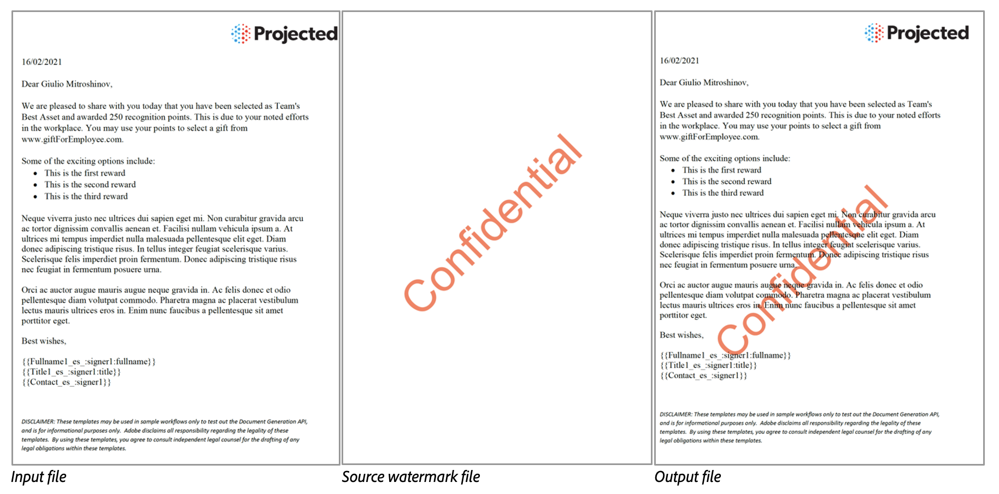

# Overview

## What is PDF Watermark API ?

A watermark in a document is usually semi-translucent or faded text, a logo, an image, or a pattern placed in the background or foreground of the page.
Watermarks are commonly used in a wide range of document types like Contracts, legal documents, certificates, confidential documents etc for security, authenticity, and branding.

PDF Watermark API is a cloud based solution to apply a watermark on specified pages of PDF document using a source file.

