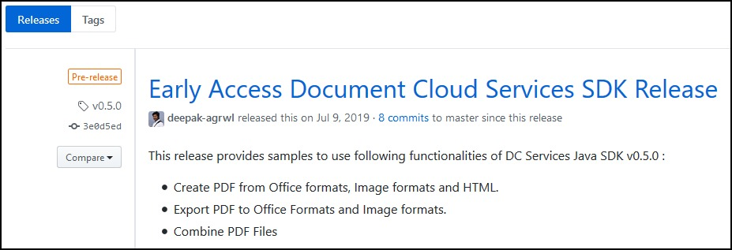

# Version - Support policy

This document describes the PDF Services SDK's and Public API's
versioning and support policies.

## SDK

### Versioning scheme

The SDK has a version format of \#.\#.\# (e.g. 1.1.0) where the numbers
correspond to a major release, minor release, and patch/update
(Major.Minor.Patch). Releases are defined as follows:

-   **Major Releases (1.x.x)**: Major releases introduce
    backward-incompatible changes to the APIs and interfaces and start
    the EOL clock for all previous releases. Developers should plan on
    migrating their code prior to the end of life of the previous major
    release.
-   **Minor Releases (x.1.x)**: Minor releases typically appear
    quarterly. Changes are backward compatible to the last major
    release. Minor releases introduce new interfaces. Existing
    interfaces continue to function but some interfaces may be
    deprecated; deprecated interfaces will be removed in a next major
    release.
-   **Patch Releases (x.x.1)**: Patch releases only deliver critical
    security or bug fixes as needed. Patch release changes are rolled
    into the next minor release so that developers can update and deploy
    new code based on their business requirements.

## Public API

### Versioning

As mentioned on [Public API
Docs](../../apis),
each operation has a unique assetId which is passed in Form Parameters.
Generally, APIs will be enhanced while keeping them backward compatible.
If its functionality can't be enhanced without breaking changes, then
its new version will be released with its own unique assetId. The
supported older API versions info will be present on [Public API
Docs](https://documentcloud.adobe.com/document-services/index.html)

Additionally, the output for the PDF Extract API is generated by a
machine learning pipeline that is frequently trained to improve
inference of document layout and structure.As a result, while changes to
the output structure are not expected between versions, specific results
may vary as the model output improves.

## Supported versions

This document as well as the URLs on Adobe's website and other
documentation link to the latest product version.

**Note**: Links to repository assets (e.g. GIT, Maven, etc.) direct to
the top level directory. To download assets that match the
documentation, navigate to the correct version. For example, When using
the 1.0.0 Java documentation, you can find the 1.0.0 samples in the GIT
repo as follows:

1.  Go to the [GIT repo](https://www.adobe.com/go/pdftoolsapi_java_samples).
2.  Select *Releases*.
3.  Select and download the needed release.



## Migration Guide to PDF Services SDK

Refer to the following table for migrating to PDF Services SDK version
3.4.0, you can also refer our Samples(
[Java](https://www.adobe.com/go/pdftoolsapi_java_samples), [Node
JS](https://www.adobe.com/go/pdftoolsapi_node_sample),
[.NET](https://www.adobe.com/go/pdftoolsapi_net_samples)). for the
latest release.

<InlineAlert slots="text"/>

The 1.X.X versions of PDF Tools SDK will be reaching End of Life in
May 2022. Once a version reaches its end of life, functionality may be
deprecated and stop working. Please upgrade to use our latest SDK
version.

### Java changes

* `artifactId` changed from `pdftools-sdk` to `pdfservices-sdk`
* Replace the `<properties>` tag and SDK `<dependency>` tag in your project’s `pom.xml` file with the following:

```
<properties>
    <project.build.sourceEncoding>UTF-8</project.build.sourceEncoding>
    <maven.compiler.source>11</maven.compiler.source>
    <maven.compiler.target>11</maven.compiler.target>
    <pdfservices.sdk.version>4.1.0</pdfservices.sdk.version>
    <pdfservices.sdk.samples.version>4.1.0</pdfservices.sdk.samples.version>
</properties>

<dependency>
    <groupId>com.adobe.documentservices</groupId>
    <artifactId>pdfservices-sdk</artifactId>
    <version>${pdfservices.sdk.version}</version>
</dependency>
```

* Update import statements as per new Package structure. For e.g.

```
import com.adobe.pdfservices.operation.ExecutionContext; 
```

### Node JS changes

* NPM package name changed from `@adobe/documentservices-pdftools-node-sdk` to `@adobe/pdfservices-node-sdk`
* Update the latest SDK dependency in package.json file of your project
 
```
"@adobe/pdfservices-node-sdk": "4.0.1"
```

* Require the `@adobe/pdfservices-node-sdk` in the Sample file to access the SDK interface

```
const PDFServicesSdk = require('@adobe/pdfservices-node-sdk'); 
```

	
For HTML to PDF Conversions, the PageLayout object is moved inside html object. To access the PageLayout interface use the following code:

```
const pageLayout = new PDFServicesSdk.CreatePDF.options.html.PageLayout(); 
```

### .NET changes

* Nuget package name changed from `Adobe.DocumentServices.PDFTools` to `Adobe.PDFServicesSDK`
* Update the SDK dependency in your project’s .csproj file with the following:

```
<ItemGroup>
    <PackageReference Include="log4net" Version="2.0.17" />
    <PackageReference Include="Adobe.PDFServicesSDK" Version="4.0.0" />
</ItemGroup> 
```

* Update the namespaces accordingly in your .cs file as per the new dependency: 
```javascript
using Adobe.PDFServicesSDK;
```  

### Python changes

* Add the following dependency in your project’s requirements.txt file:

```
pdfservices-sdk~=4.0.0
```

## Archived Documentation

The last major version of our documentation may be found [here](../legacy-documentation/).


## Change types

Change types include the following:

-   **New**: Features or implementation changes added in the current
 release.
-   **Changed**: Modified code that changes a feature or implementation
 detail.
-   **Security**: A patch or bug fixed released in an out-of-band patch.
-   **Deprecated**: Existing functionality for which support is ending
 (or ended).

<InlineAlert slots="text" />

Minor and Patch releases are backward compatible with the previous release.
Upgrading to the latest SDK should not break existing applications.

## Change history

### July 22, 2024; .NET SDK 4.0.0 major release
- Released Adobe PDF Services .NET SDK v4.0.0, introducing new interfaces fully leveraging power of new PDF Services rest APIs.
- Added support for delete asset, refresh download URI and webhook notifiers.
- Eliminated need of storage to save intermediate result by removing dependency on temporary storage.
- Extended I/O capabilities by introducing external storage for PDF Services operations.
- Enabled connection to Internet through Proxy, where proxy server settings can be set via "proxyServerConfig" in the client config.
- Updated PDF Properties operation to return PDFProperties object along with JSON string.
- Updated Extract PDF operation to return content and resource asset along with content JSON object.

### July 22, 2024; PDF Accessibility Checker API Added

- Added [PDF Accessibility Checker](../pdf-services-api/howtos/pdf-accessibility-checker-api/) operation in PDF Services API to check accessibility on specified pages of PDF document.


### July 16, 2024; Server Side Release - Get PDF Properties

- Bug fixes [Get PDF Properties](../pdf-services-api/howtos/pdf-properties/) fixed data issue related to permissions in JSON response.

### July 09, 2024; Server Side Release

- Added [PDF Watermark](../pdf-services-api/howtos/pdf-watermark-api/) operation in PDF Services API to add a watermark on specified pages of PDF document.

### June 12, 2024; NodeJS SDK 4.0.1 patch release

- Bug fixes and stability improvements.

### June 05, 2024; .NET SDK 3.5.1 patch release

- Bug fixes and stability improvements.

### June 04, 2024; Java SDK 4.1.0 minor release

- Extend support for external storage and notifier config for all the operations.

### May 22, 2024; Python SDK 4.0.0 major release

- Released Adobe PDF Services Python SDK v4.0.0, introducing new interfaces fully leveraging power of new PDF Services REST APIs.
- Added support for all the operations powered by the Adobe PDF Services APIs.
- Added support for deleting assets and webhook notifiers.
- Removed the need for intermediate result storage for chained operations by eliminating reliance on temporary local storage.
- Extended I/O capabilities by introducing external storage for PDF Services operations.
- Enabled connection to Internet through Proxy, where proxy server settings can be set via Proxy Server Config.

### May 15, 2024; .NET SDK 3.5.0 minor release

- Added support to enable or disable "configureAwait" using client config, which will allow developers to specify whether asynchronous continuations should execute on the original synchronization context or not. **Note**: Starting from the next major release, "configureAwait" will be disabled by default and won't be configurable.

### April 30, 2024; Adobe Document Generation Server Side Release

- Added support for [discard the row in a horizontal table](../document-generation-api/tablewithmarkers/#discard-the-row-in-a-horizontal-table-if-the-condition-evaluates-to-true) in Document Generation API.

### April, 2024; NodeJS SDK 4.0.0 major release

- Released Adobe PDF Services Node SDK v4.0.0, introducing new interfaces fully leveraging power of new PDF Services rest APIs.     
- Added support for delete asset and webhook notifiers.                                                                             
- Eliminated need of storage to save intermediate result by removing dependency on temporary storage.                               
- Extended I/O capabilities by introducing external storage for PDF Services operations.                                            
- Enabled connection to Internet through Proxy, where proxy server settings can be set via "proxyServerConfig" in the client config.
- Updated PDF Properties operation to return PDFProperties object along with JSON string.                                           
- Updated Extract PDF operation to return content and resource asset along with content JSON object.                                

### April, 2024; Server Side Release

- Added support for [Webhook Notification](../pdf-services-api/howtos/webhook-notification/) in PDF Properties.
- Added support for [External Storage](../pdf-services-api/howtos/pdf-external-storage-sol/) in Extract PDF, Split PDF, PDF Electronic Seal and Auto-Tag PDF.
- Added support for [Webhook Notification](../pdf-services-api/howtos/webhook-notification/) for external storage operations.

### March, 2024; Python SDK 2.3.1 patch release

- PDF operations now support configurable timeouts.

### February, 2024: .NET SDK 3.4.1 patch release

- Dependent library upgrades and fixed compatibility issues with RestSharp v110+.


### January, 2024; Java SDK 4.0.0 major release

- Released Adobe PDF Services Java SDK v4.0.0, introducing new interfaces fully leveraging power of new PDF Services rest APIs.
- Added support for delete asset, refresh download URI, webhook notifiers.
- Eliminated need of storage to save intermediate result by removing dependency on temporary storage.
- Extended I/O capabilities by introducing external storage for a majority of PDF Services operations.
- Updated PDF Properties operation to return PDFProperties object along with JSON string.
- Updated Extract PDF operation to return content and resource asset along with content JSON object.


### January, 2024; Server Side Release

- Added support for [Webhook Notification](../pdf-services-api/howtos/webhook-notification/) in all the operations **except** PDF Properties.

### January, 2024: Adobe Document Generation Server Side Release

- Added support for [Table Tag with Markers](../document-generation-api/tablewithmarkers) in Document Generation API.

### December, 2023: Java SDK 3.5.1 patch release

- Dependent library upgrades and fixed compatibility issues with Spring Boot v3.x.

### October, 2023: Java SDK 3.5.0 minor release

- Added support for document level permissions and trusted timestamping (using [supported TSAs](../pdf-electronic-seal-api/#supported-timestamping-authorities)) in java sdk for [PDF Electronic Seal API](../pdf-electronic-seal-api/).

### October, 2023; Adobe Document Generation Server Side Release

- Performance Improvements - Available in [REST API](../apis/#tag/Document-Generation) and SDK(s) v3.0.0 and above.

### August, 2023; Server Side Release

- Added support for document level permissions and trusted timestamping (using [supported TSAs](../pdf-electronic-seal-api/#supported-timestamping-authorities)) in [PDF Electronic Seal API](../pdf-electronic-seal-api/).
- Added support for [External Storage](../pdf-services-api/howtos/pdf-external-storage-sol/) in all the operations **except** Extract PDF, Split PDF, PDF Electronic Seal and Auto-Tag PDF.

### August, 2023, NodeJS SDK 3.4.2 minor release

- Restructured the internals for improved organization.

### July, 2023, NodeJS SDK 3.4.1 minor release

- Fixed links in README.md file.

### June, 2023; Java,NodeJS,.NET SDK 3.4.0 minor release

- PDF Electronic Seal operation is now available for all the users in PDF Services SDKs and REST APIs.
- Added support for OAuth based Server to Server credentials in PDF Services SDKs.
- JWT based service account credentials and corresponding SDK interfaces are now deprecated.

### June, 2023; Python SDK 2.3.0 minor release

- Added support for OAuth based Server to Server credentials in PDF Services SDKs.
- JWT based service account credentials and corresponding SDK interfaces are now deprecated.

### June, 2023; Adobe Document Generation Server Side Release

- Added support for [External Storage](../pdf-services-api/howtos/pdf-external-storage-sol/) in Document Generation API.
