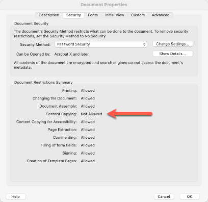

## Security  

At Adobe, we know the security of your digital experiences is important. Security practices are deeply ingrained into our internal software development and operations processes and tools and are rigorously followed by our cross functional teams to prevent, detect, and respond to incidents in an expedient manner. Furthermore, our collaborative work with partners, leading researchers, security research institutions, and other industry organizations helps us keep up to date with the latest threats and vulnerabilities, and we regularly incorporate advanced security techniques into the products and services we offer.  

### Acrobat Services APIs Hosting and Security

All Server-side components of PDF Services API and PDF Embed API are processed in Adobe Document Cloud, which is hosted on the data centers of AWS cloud infrastructure in the US-East and EMEA regions. Customers can choose the region where their documents will be processed.

Publicly accessible and downloadable components, such as Acrobat Services SDKs and JavaScript libraries, are hosted on providers relevant to the component, such as library repositories and CDNs.

#### Data Encryption

All content in transit is encrypted using TLS 1.2 or greater.

#### Acrobat Services API Security

##### Authentication

The Acrobat Services APIs support Service Account authentication. For more information on this authentication type, please refer to the OAuth Server to Server credential section in the authentication guide linked here [Adobe I/O Authentication Overview](https://www.adobe.io/developer-console/docs/guides/authentication/).

##### User-Generated Content Storage

The PDF Services API accepts and returns user-generated content (UGC). This content is uploaded to Adobe Document Cloud and temporarily cached as part of normal service operations.

#### PDF Embed API Security

##### Authentication

PDF Embed API is a client-side JavaScript- and WASM-based library and does not initiate any calls to cloud-based services except for the following three scenarios:
- Validating the client ID specified in JavaScript code upon loading;
- Logging anonymous usage data in Adobe Analytics for internal use by Adobe for product improvement and feedback.
- Logging event data for out-of-the-box analytics and a pre-configured analytics dashboard is strictly opt-in and requires explicit configuration by the developer. If provided with an Adobe Analytics report suite ID by the PDF Embed API integrator, this logging occurs.

##### Iframe Security

The core functionality of PDF Embed API is contained within a sandboxed HTML iframe, which helps prevent any vulnerabilities in the library from affecting the host website and vice versa. It also prevents unintended document object model (DOM) access and manipulation across the iframe boundary.

##### Content Security Policy (CSP)

Content loaded in the iframe is governed by CSP directives that help protect against certain kinds of attacks, including cross-site scripting (XSS).

##### Content Storage

The PDF Embed API does not manage content in cloud storage. Its primary functionality is restricted to loading and rendering PDF files supplied by the customer and, when asked to, saving a copy of the loaded file to local drives or external storage. Any controls or storage of the documents depend on the website or the browser's access controls to the PDF file.

#### Details on User-Generated Content Storage

##### Interacting with the API

Adobe Acrobat Services APIs are a collection of multiple services capable of quickly solving specific challenges and powering multi-step document workflows. With them, you gain access to basic PDF services, such as creating, securing, compressing, converting, combining, and splitting PDFs, as well as more advanced services, including Document Generation API and PDF Extract API.

You can access the Acrobat Services by using our REST API, working through one of our SDKs for Node.js, Java, Python and .NET, or using Microsoft Power Automate, Workfront Fusion, and UiPath connectors. This section reviews the transient storage options for each method of using Acrobat Services.

All documents either uploaded as assets or generated as output by the API are stored in Adobe Document Cloud for 24 hours by default. It is important to note that the asset is only available to the developer using the same credential under which the asset was generated or  by the signed URL provided by the API. There is no API to get a list of the available assets.

#### Acrobat Services Data Flow Diagram

The following diagram illustrates the typical flow of data between the customer’s environment and Adobe Document Cloud.


##### Data Flow Narrative:

###### Step 1: Get Access Token Using Credentials

a. Request Platform API for Generating the Access Token - This step involves obtaining an authentication token using valid credentials. Typically, this involves sending authentication details such as a client_id and client_secret to the server and the server will generate the token. The token will be used for subsequent authorization and access to resources.
details such as a client_id and client_secret to the server and the server will generate the token. The token will be used for subsequent authorization and access to resources.

b. Received Access Token To Client - After successfully generating the token in the previous step, the Acrobat Services will return it to the client. This token is then utilized for authentication purposes in the subsequent API requests. The access token acts as a digital key, allowing the bearer to access protected resources on behalf of the user or application that obtained the token.

###### Step 2: Get the URL to Upload Input File

a. Request for Upload URL - Here, the client requests a specific URL designated for uploading files. It's the URL where the file needs to be sent for storage.

b. Receive a URL For Upload - This step refers to the actual URL obtained from the Acrobat Services. It's the location where the file will be uploaded. This URL is crucial for initiating the upload process in the subsequent steps.

###### Step 3. Upload Input File to Storage

a. Read Input File from Client Storage - In this step, the client system reads the input file from the designated storage location. This could be a local file system, cloud storage service, or any other storage medium where the input file is stored in the client ecosystem.

b. Upload Input File to Acrobat Services Transient Storage - Once the input file is retrieved, it is uploaded to the transient storage using the URL provided by the Acrobat Services. Transient storage typically refers to temporary storage used for short-term operations like processing or transformation.

###### Step 4. Submit a Request to Perform Operation

a. Submit a Request to Platform Service - After the input file is uploaded, the client submits a request to the PDF service to perform the desired operation, such as create pdf, export pdf etc. This request includes the necessary parameters or instructions for the operation to be executed.

b. Received Job URI For Poll - After successfully submitting the request to the Acrobat Services, the client will receive a job URL in the location response header. The Platform API is asynchronous in nature, so the client needs to use this job URL to poll for the response until the result is received.

###### Step 5. Upload Output File upon Operation Completion

Upon completion of the requested operation by the PDF service, the resulting output file is generated. This output file is then uploaded to a designated location, ready for retrieval and further processing.

###### Step 6. Poll for Response

a. Poll Request - The Platform API is asynchronous, so after receiving the job URL, the client needs to use it to poll for the response until the result is received.

b. Output Response (URL to download output file) - Once the processing is completed and result is ready, client will get a response containing a URL using which the output file can be downloaded. This URL typically points to the location where the output file is stored temporarily.

###### Step 7. Download/Save Output File

a. Download File Using URL - With the URL obtained in the previous step, the system proceeds to download the output file from the AWS storage where it's hosted. This step ensures that the processed output is retrieved and made available for further actions or distribution.

b. Write Output File into Storage - After downloading the output file, it is written or saved into the designated storage location. This ensures that the processed output is persisted and accessible for future reference or usage.

###### Step 8. Delete Asset (Optional)

a. Submit Delete Asset Request - This step involves optionally deleting the input asset or any other assets associated with the processing task. Deleting assets helps in managing storage resources efficiently and maintaining data privacy and security. The client will request the Platform service to delete the file associated with assetId.

b. Delete Asset from Cloud Storage - After receiving the delete request, the Acrobat Services delete the file associated with asset from cloud storage. It ensures that unnecessary files or data are removed from the system, reducing clutter and potential security risks.

#### Adobe Acrobat Services REST API

Calling the REST API directly offers the most flexible storage options. For most of the Acrobat Services, uploading and downloading assets to Adobe Document Cloud is not required. Developers can “bring their own storage” with signed URLs. Additionally, the REST API can delete assets uploaded to or generated by Acrobat Services immediately after they are no longer needed using the [Assets endpoint with the DELETE verb](https://developer.adobe.com/document-services/docs/apis/#tag/Assets/operation/asset.delete).

Acrobat Services APIs support accessing files directly from the external storage of the client. The client can invoke the APIs with signed URLs, and the files will be automatically accessed from their external storage. The signed URL temporarily provides access to a resource. Signed URLs contain user/authentication information, allowing systems without credentials to access the given resource. PDF Services APIs support the signed URLs of input and output files in the request body.

**Supported External Storage Solutions**

The concept of signed URLs is common across various cloud storage solutions for downloading and uploading files. Adobe PDF Services APIs currently support the signed URLs generated through the following external storage providers.

- Microsoft SharePoint
- Amazon S3
- Dropbox
- Microsoft Azure Blob

**Adobe PDF Services SDKs**

Because the PDF Services API is REST-based, developers can use any language that supports HTTP. However, SDKs are also available for Java, .NET, Node.js, and Python.

**Version 3.x.x SDKs:**

For the .NET, Node.js, and Python SDKs, all documents that have been uploaded as assets or were produced as output by the API remain available on the servers for 24 hours. It is important to note that the asset is only available to the developer using the same credential under which the asset was generated or only by the signed URL provided by the API. There is no API to get a list of the available assets.

**Version 4.x.x SDKs:**

The Java SDK version 4.0.0 introduces new interfaces to fully leverage the power of the PDF Services REST APIs. Like the REST APIs, it supports external storage, and the ability to immediately delete assets from the Adobe servers after processing.

**Adobe PDF Services connector for Microsoft Power Automate**
The Adobe PDF Services connector for Microsoft Power Automate will automatically delete assets that have been uploaded after they have been processed in Adobe Document Cloud.

#### Processing Secured PDF Files

##### PDF Document Security and Permissions

PDF document security and permissions allow the PDF creator to retain control of the document and associated usage rights. You can limit access to a PDF by setting passwords and by restricting certain features, such as printing, commenting, and editing. Two types of passwords are available:

**Document open password**: A document open password (also known as a user password) requires the user to type a password to open the PDF.

**Permissions password**:  A permissions password (also known as an owner password) protects changes to permission settings. Using a permissions password, you can restrict printing, editing, and copying content in the PDF. Recipients don’t need a password to open the PDF in Acrobat, Acrobat Reader, and other conforming PDF readers.

If the PDF is secured with both types of passwords, it can be opened with either password. However, only the permissions password allows the user to change the restricted features.

Both types of passwords can affect the use of Adobe PDF Services API.

##### Processing PDF files that require a password to open (User Password)

PDF files secured to require a password to open cannot be processed by PDF Services API. For PDF files where the password is known and the PDF author has authorized it, the Remove Protection API can be used to remove the security from these PDF files prior to processing with one of the other Acrobat Services.

##### Processing PDF files that have restricted permissions (Owner Password)

PDF files that have any security settings to permit or deny functionality in conforming PDF readers cannot be processed by Acrobat Services, except for the following.

**Extract API**: PDF files with security settings that prevent content copying cannot be processed by Extract API. The call returns a statusCode of 400 with the errorCode 'DISQUALIFIED_PERMISSIONS'.



**PDF to Images**: PDF files with security settings that prevent content copying, page extraction, document assembly, or printing cannot be processed by PDF to Images API.

##### Detecting PDF Permissions

For PDF files where the password is known and the document owner has granted permission, the [Remove Protection API](https://developer.adobe.com/document-services/docs/apis/#tag/Remove-Protection) can be used to remove the security from these PDF files prior to processing with one of the other Acrobat Services.

If that is not possible, developers can detect the permissions applied to a PDF file by using the [PDF Properties API](https://developer.adobe.com/document-services/docs/apis/#tag/PDF-Properties). The response from PDF Properties is a JSON object that contains a "security_info" key within a "permissions" key. The JSON corresponds to what you would see in the Security Tab of the Acrobat Document Properties dialog.

```yaml
"permissions": {
    "assistive_technology": false,
    "form_filling": false,
    "copying": false,
    "page_extraction": false,
    "document_assembly": false,
    "commenting": false,
    "printing": "none",
    "editing": false
}
```


##### The Effect of PDF Permissions on Adobe PDF Services API

Except for when PDF Extract API and Export PDF API convert PDF to images, the Acrobat Services cannot process PDF files that have any permissions set to false and will return a 400 error.

PDF Extract API will process the PDF when “copying” is set to true.

Export PDF API will process the conversion from PDF to images when “copying”. “page_extraction”, “document_assembly”, and ”printing” are all true.

## Privacy

The Adobe Privacy Policy describes the privacy practices of Adobe's Services and Software (as defined in our General [Terms of Use](https://www.adobe.com/legal/terms.html)) and anywhere we display or reference this policy. For more information, please visit this [page](https://www.adobe.com/privacy/policy.html).  

## Compliance

Our [open, flexible framework](https://www.adobe.com/trust/compliance/adobe-ccf.html) adapts to constantly changing standards and regulations to help provide ongoing compliance across all our products and services. To learn more, please visit this [link](https://www.adobe.com/trust/compliance/compliance-list.html). 
